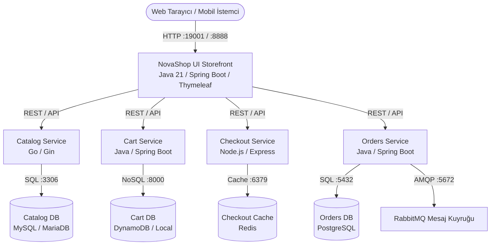

# NovaShop DevOps Store

> **From Code to Cloud** — Uygulamalı DevOps Eğitim Projesi

> [!IMPORTANT]
> **Eğitim ve Laboratuvar Amaçlı Kullanım Bildirimi:**  
> Bu depo ve içerisindeki kaynak kodlar, konfigürasyon dosyaları, betikler ve altyapı şablonları **yalnızca eğitim, simülasyon ve laboratuvar çalışmaları için hazırlanmıştır**. Canlı üretim (Production) ortamlarında doğrudan kullanılmak üzere tasarlanmamıştır; kurumsal üretim ortamlarının gerektirdiği ileri düzey güvenlik sertleştirmeleri, yüksek erişilebilirlik (HA), olağanüstü durum kurtarma ve uyumluluk politikalarını içermez.

NovaShop DevOps Store, tek bir e-ticaret uygulamasının modern DevOps ve Cloud-Native teslim zinciri boyunca adım adım nasıl olgunlaştığını gösteren yaşayan eğitim platformudur:

`plan → code → review → test → quality → security → package → registry → deploy → verify → observe → respond → improve`

---

## Mimari ve Bileşenler

Uygulama, mikroservis mimarisine sahip çok dilli (polyglot) modern bir e-ticaret platformudur:



### Servis Envanteri

| Servis | Teknoloji / Dil | Port | Görev |
|---|---|---|---|
| **UI** | Java 21 / Spring Boot / Thymeleaf | 8080 (Host 19001 / 8888) | Mağaza ön yüzü, ürün vitrini ve API aggregator |
| **Catalog** | Go / Gin | 8080 (Host 8081) | Ürün kataloğu ve kategori sorgulama API'si |
| **Cart** | Java 21 / Spring Boot | 8080 (Host 8082) | Kullanıcı sepeti ve ürün ekleme API'si |
| **Orders** | Java 21 / Spring Boot | 8080 (Host 8083) | Sipariş oluşturma ve asenkron kuyruk yönetimi |
| **Checkout** | Node.js / Express | 8080 (Host 8085) | Ödeme ve sipariş tamamlama orkestrasyonu |

---

## Nasıl Çalışılır?

Her laboratuvarda kullanılan araç ve komutlar adım adım doğrudan terminalden uygulanır. Yardımcı betikler ise işlem adımları anlaşıldıktan sonra otomasyon, test ve hızlı doğrulama amacıyla kullanılır.

İzlenecek sıra:

1. İlgili LAB belgesindeki ön koşulları ve numaralı manuel adımları uygulayın.
2. Her komutun ne yaptığını ve beklenen çıktıyı kontrol edin.
3. Varsa helper betiğiyle aynı sonucu tekrar edin.
4. `verify-lab-XX.sh` ile sonucu doğrulayın.
5. Cleanup adımını uygulamadan sonraki ağır profile geçmeyin.

### Yerel `.env` Kuralı

Starter profilinin parolaya ihtiyacı yoktur. Full Compose, AWS 3-tier veya Observability çalıştırmadan önce yalnızca yerel makinenizde `.env` oluşturun:

```bash
cp config/project.env.example .env
chmod 600 .env
nano .env
```

`DB_PASSWORD` ve `GRAFANA_ADMIN_PASSWORD` placeholder değerlerini gerçek yerel değerlerle değiştirin. `.env` Git tarafından yok sayılır; asla commit edilmez. Cloud dağıtımlarında bu değerler yerine ilgili labın anlattığı GitHub/GitLab secret mekanizması veya AWS Secrets Manager kullanılır.

## Hızlı Başlangıç (Starter Profil)

NovaShop UI, arka plan servisleri hazır olmadığında otomatik olarak **in-memory mock** modunda çalışır. Böylece harici veritabanları kurmadan arayüzü hemen test edebilirsiniz.

### Ön Koşullar
- Docker yüklü bir sistem (Ubuntu 22.04+ önerilir)

### 1. Güvenli Starter Compose Profilini Başlatın

Bu helper, gerçek UI Compose dosyasıyla güvenlik overlay'ini birlikte kullanır; imajı derler, UI'ı 8888 portunda başlatır ve healthcheck tamamlanana kadar bekler:

```bash
bash scripts/compose-starter.sh up
```

### 2. Sağlık, Marka ve Güvenlik Doğrulaması

```bash
bash scripts/verify/verify-lab-03.sh
```

Bu komut `/actuator/health`, NovaShop marka başlığı ve favicon için fail-fast smoke testi uygular. İmajı manuel derleme, doğrudan `docker run` kullanımı ve Dockerfile incelemesi LAB-03 içinde adım adım ayrıca öğretilir.

### 3. Tarayıcıda İnceleyin

Tarayıcınızdan `http://localhost:19001` (veya `:8888`) adresini açın.

### 4. Durdurun ve Temizleyin

```bash
bash scripts/compose-starter.sh down
```

---

## Uygulama Modülleri ve Laboratuvarlar

> [!NOTE]
> **Modül Kapsamı:** Yanında **`*`** işareti bulunan laboratuvarlar **çekirdek (Core)** modüllerdir; yerel Docker ve Kind ortamlarında harici bulut gereksinimi olmadan çalışır. Diğer laboratuvarlar AWS ortamı gerektiren modüllerdir.

Tablodaki her bağlantı adım adım kurulum ve uygulama kılavuzunu içerir. Sağdaki komutlar yapılandırma ve çalışma durumunu doğrulamak için kullanılır.

| Lab | Kapsanan Konu | Doğrulama Komutu |
|---|---|---|
| [LAB-00](labs/LAB-00-PLATFORM-SETUP/README.md) | Platform kurulumu: GitLab CE, Harbor, SonarQube, Jenkins ve Nginx SSL | Manuel kurulum rehberleri |
| **[LAB-01*](labs/LAB-01/README.md)** | Git, branch, PR ve conflict çözümü | `bash scripts/verify/verify-lab-01.sh` |
| [LAB-02](labs/LAB-02/README.md) | AWS 2-Tier altyapı: VPC, EC2 Web, Single-AZ RDS MySQL ve Terraform IaC | `bash scripts/verify/verify-lab-02.sh --config-only` |
| **[LAB-03*](labs/LAB-03/README.md)** | Dockerfile, Docker CLI ve Compose | `bash scripts/compose-starter.sh up`; `bash scripts/verify/verify-lab-03.sh` |
| [LAB-04](labs/LAB-04/README.md) | EC2 üzerinde 3-tier Compose, Nginx ve TLS | `bash scripts/compose-3tier.sh up`; `bash scripts/verify/verify-lab-04.sh` |
| **[LAB-05*](labs/LAB-05/README.md)** | GitHub Actions, OIDC, ECR ve rollback | `bash scripts/verify/verify-lab-05.sh` |
| **[LAB-06*](labs/LAB-06/README.md)** | Kind, kubectl ve Helm | `bash scripts/setup-kind-cluster.sh`; `bash scripts/verify/verify-lab-06.sh` |
| **[LAB-07*](labs/LAB-07/README.md)** | GitLab, Jenkins ve Harbor | `bash scripts/verify/verify-lab-07.sh` |
| **[LAB-08*](labs/LAB-08/README.md)** | SonarQube, Trivy, Gitleaks ve SBOM | `bash scripts/generate-sbom.sh`; `bash scripts/verify/verify-lab-08.sh` |
| **[LAB-09*](labs/LAB-09/README.md)** | Argo CD ve GitOps uzlaştırması | `bash scripts/verify/verify-lab-09.sh` |
| **[LAB-10*](labs/LAB-10/README.md)** | Prometheus, Grafana, OTel, Jaeger ve Alertmanager | `bash scripts/compose-observability.sh up`; `bash scripts/verify/verify-lab-10.sh` |
| **[LAB-11*](labs/LAB-11/README.md)** | Merkezi loglama (ELK Stack): Fluent Bit, Elasticsearch ve Kibana | `bash scripts/verify/verify-lab-11.sh` |
| **[LAB-12*](labs/LAB-12/README.md)** | Terraform modülleri, remote S3 state ve DynamoDB locking | `bash scripts/verify/verify-lab-12.sh` |
| [LAB-13](labs/LAB-13/README.md) | EKS, IRSA ve AWS Load Balancer Controller | `bash scripts/verify/verify-lab-13.sh` |
| [LAB-14](labs/LAB-14/README.md) | ECS Fargate, ALB ve CI/CD | `bash scripts/verify/verify-lab-14.sh` |

Tüm yapılandırmaları hızlı ön kontrolden geçirmek için, servisler kapalıyken bile şu komut kullanılabilir:

```bash
bash scripts/verify/verify-all-labs.sh --config-only
```

LAB-03 starter UI çalışırken canlı smoke kontrollerini de eklemek için:

```bash
bash scripts/verify/verify-all-labs.sh --live
```

---

## Lisans ve Kaynak Atfı

- NovaShop DevOps Store, AWS Containers Retail Store Sample App (`https://github.com/aws-containers/retail-store-sample-app`) projesinden eğitim amacıyla uyarlanmıştır.
- Orijinal kodlar Amazon.com, Inc. or its affiliates mülkiyetinde olup **MIT-0** ([LICENSE](LICENSE)) lisansı altındadır.
- Detaylı bağımlılık ve kaynak atıf bilgileri için [UPSTREAM.md](UPSTREAM.md) dosyasını inceleyebilirsiniz.
