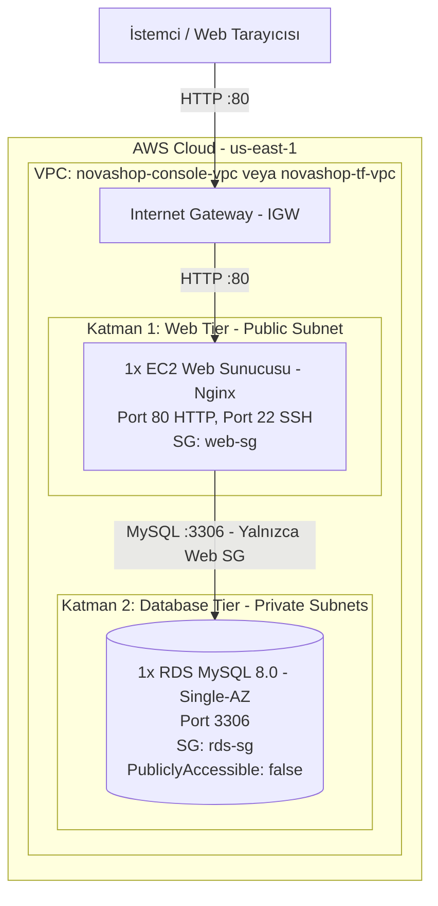

# LAB-02-AWS-BASICS — AWS Temel Altyapı: AWS Console ve Terraform ile 2-Katmanlı Mimari (Web & Database)

| Seviye | Profil / Araçlar | Açık Portlar |
|---|---|---|
| Başlangıç - Orta | AWS Console, Terraform, AWS VPC, EC2, RDS MySQL | 22 (SSH), 80 (HTTP), 3306 (MySQL Private) |

---

### Amaç

NovaShop e-ticaret uygulamasının 2-katmanlı temel bulut altyapısını (Public Subnet'te 1x EC2 Nginx Web Sunucusu ve Private Subnet'te 1x Single-AZ RDS MySQL Veritabanı) hem **AWS Yönetim Konsolu (Web UI)** hem de **HashiCorp Terraform (IaC)** ile kurmayı öğrenmektir.

Her iki kurulum aynı AWS hesabında bağımsız ve çakışmadan çalışacak şekilde tasarlanmıştır:
- **AWS Console Kurulumu:** `novashop-console-*` ön eki ve `10.0.0.0/16` IP bloğu
- **Terraform Kurulumu:** `novashop-tf-*` ön eki ve `10.1.0.0/16` IP bloğu

---

### Kazanımlar

- **VPC Mimarisi:** Virtual Private Cloud (VPC), Public Subnet, Private Subnet, Internet Gateway (IGW) ve Route Table yapılandırması.
- **Güvenlik Grupları (Security Groups):** Katmanlı güvenlik ilkesiyle web sunucusuna HTTP/SSH, veritabanına yalnızca EC2 güvenlik grubundan port 3306 erişimi verme.
- **EC2 & Cloud-Init:** Ubuntu 22.04 LTS üzerinde `user_data` ile Nginx web sunucusunu ve `/healthz` sağlık kontrolünü devreye alma.
- **RDS MySQL (Private):** DB Subnet Group oluşturarak veritabanını dış internete tamamen kapalı (`PubliclyAccessible: false`) ve Single-AZ olarak konuşlandırma.
- **Terraform IaC:** Modüler kod tabanı (`vpc`, `security`, `ec2`, `rds`) ile insan hatasını sıfırlayarak altyapıyı otomatik kurma.
- **Maliyet ve Temizlik:** Laboratuvar bitiminde kaynakları kontrollü biçimde (`terraform destroy` ve Console silme adımları) temizleme.

---

### Ön koşullar

> [!NOTE]
> Bu laboratuvar AWS Cloud ortamı kullanır. Yerel Kind veya Docker platformlarımız maliyetsiz çalışırken, bu lab için geçerli bir AWS hesabı ve IAM erişim yetkisi gerekmektedir.

- **Önceki Lab:** [LAB-01](../LAB-01/README.md) tamamlanmış olmalıdır.
- **AWS Hesabı:** VPC, EC2 ve RDS oluşturma yetkisine sahip bir AWS IAM kullanıcısı.
- **Gerekli Araçlar:** Web Tarayıcısı (AWS Console için), `terraform` (v1.5+), `curl`, `ssh`.
- **AWS API Anahtarları (Bölüm 2 için):** `AWS_ACCESS_KEY_ID` ve `AWS_SECRET_ACCESS_KEY`.

---

### Mimari Şema




---

## BÖLÜM 1: AWS Yönetim Konsolu (Web UI) ile Adım Adım Kurulum

Bu bölümde AWS Web Konsolu arayüzünü kullanarak altyapıyı adım adım oluşturacağız.

### Adım 1.1: VPC ve Subnet'lerin Oluşturulması

1. [AWS Management Console](https://console.aws.amazon.com/)'a giriş yapın ve bölge olarak **US East (N. Virginia) `us-east-1`** seçin.
2. Arama çubuğuna **VPC** yazın ve VPC paneline gidin.
3. Sol menüden **Your VPCs** -> **Create VPC** butonuna tıklayın:
   - **Resources to create:** `VPC only` seçin.
   - **Name tag:** `novashop-console-vpc`
   - **IPv4 CIDR block:** `10.0.0.0/16`
   - **Create VPC** butonuna tıklayın.
4. **DNS Ayarlarını Etkinleştirin:**
   - Oluşturduğunuz `novashop-console-vpc`'yi seçin -> **Actions** -> **Edit VPC settings**.
   - **Enable DNS hostnames** kutucuğunu işaretleyin ve kaydedin.
5. **İnternet Ağ Geçidi (Internet Gateway) Oluşturun:**
   - Sol menüden **Internet Gateways** -> **Create internet gateway**.
   - **Name tag:** `novashop-console-igw` -> **Create internet gateway**.
   - Açılan sayfada **Actions** -> **Attach to VPC** -> `novashop-console-vpc` seçin ve **Attach** butonuna tıklayın.
6. **Subnet'leri Oluşturun (Sol menüden Subnets -> Create subnet):**
   - **VPC ID:** `novashop-console-vpc` seçin.
   - **Subnet 1 (Public):**
     - Subnet name: `novashop-console-public-1a`
     - Availability Zone: `us-east-1a`
     - IPv4 subnet CIDR block: `10.0.1.0/24`
   - **Add new subnet** butonuna tıklayın.
   - **Subnet 2 (Private 1):**
     - Subnet name: `novashop-console-private-1a`
     - Availability Zone: `us-east-1a`
     - IPv4 subnet CIDR block: `10.0.10.0/24`
   - **Add new subnet** butonuna tıklayın.
   - **Subnet 3 (Private 2 - RDS Gereksinimi):**
     - Subnet name: `novashop-console-private-1b`
     - Availability Zone: `us-east-1b`
     - IPv4 subnet CIDR block: `10.0.11.0/24`
   - **Create subnet** butonuna tıklayın.
7. **Public Subnet için Otomatik IP Atamasını Açın:**
   - `novashop-console-public-1a` seçin -> **Actions** -> **Edit subnet settings** -> **Enable auto-assign public IPv4 address** işaretleyin ve kaydedin.
8. **Route Table Yapılandırması:**
   - Sol menüden **Route Tables** -> **Create route table**.
   - **Name:** `novashop-console-public-rt`, **VPC:** `novashop-console-vpc` -> **Create**.
   - Oluşturulan route table seçili iken **Routes** sekmesi -> **Edit routes** -> **Add route**:
     - Destination: `0.0.0.0/0`
     - Target: `Internet Gateway` -> `novashop-console-igw` seçin -> **Save changes**.
   - **Subnet associations** sekmesi -> **Edit subnet associations**:
     - `novashop-console-public-1a` kutucuğunu işaretleyin -> **Save associations**.

---

### Adım 1.2: Güvenlik Gruplarının (Security Groups) Oluşturulması

1. Sol menüden **Security Groups** -> **Create security group**:
   - **Security group name:** `novashop-console-web-sg`
   - **Description:** `Web tier SG (HTTP and SSH)`
   - **VPC:** `novashop-console-vpc`
   - **Inbound rules (Giriş Kuralları):**
     - **Kural 1:** Type: `HTTP`, Port: `80`, Source: `Anywhere-IPv4` (`0.0.0.0/0`).
     - **Kural 2:** Type: `SSH`, Port: `22`, Source: `My IP` (Kendi IP adresiniz).
   - **Create security group** butonuna tıklayın.
2. İkinci güvenlik grubunu oluşturun (RDS için):
   - **Create security group** butonuna tıklayın.
   - **Security group name:** `novashop-console-rds-sg`
   - **Description:** `Database tier SG (MySQL only from Web SG)`
   - **VPC:** `novashop-console-vpc`
   - **Inbound rules:**
     - Type: `MYSQL/Aurora`, Port: `3306`, Source: `Custom` -> Açılan kutudan `novashop-console-web-sg` grubunu seçin.
   - **Create security group** butonuna tıklayın.

---

### Adım 1.3: EC2 Web Sunucusunun Başlatılması

1. AWS Console arama çubuğuna **EC2** yazın ve **Instances** -> **Launch instances** butonuna tıklayın:
   - **Name:** `novashop-console-web`
   - **Application and OS Images:** `Ubuntu` -> `Ubuntu Server 22.04 LTS (HVM), SSD Volume Type`
   - **Instance type:** `t3.medium` (2 vCPU, 4 GB RAM) veya `t3.small` seçin.
   - **Key pair (login):** Mevcut bir `.pem` key pair seçin veya **Create new key pair** diyerek `novashop-key` adıyla oluşturup indirin.
2. **Network settings** bölümünde **Edit** butonuna tıklayın:
   - **VPC:** `novashop-console-vpc`
   - **Subnet:** `novashop-console-public-1a`
   - **Auto-assign public IP:** `Enable`
   - **Firewall (security groups):** `Select existing security group` -> `novashop-console-web-sg` seçin.
3. **Advanced details (Gelişmiş Ayrıntılar)** bölümünü genişletin ve en alttaki **User data** kutusuna şu betiği yapıştırın:
   ```bash
   #!/bin/bash
   set -e
   export DEBIAN_FRONTEND=noninteractive
   apt-get update -y
   apt-get install -y nginx curl mysql-client

   cat << 'CONF' > /etc/nginx/conf.d/novashop.conf
   server {
       listen 80 default_server;
       listen [::]:80 default_server;
       server_name _;

       location = /healthz {
           access_log off;
           default_type application/json;
           return 200 '{"status":"UP","layer":"web","provisioner":"aws-console","service":"novashop-storefront"}\n';
       }

       location / {
           default_type text/html;
           return 200 '<!DOCTYPE html><html><head><title>NovaShop DevOps Store (AWS Console)</title><style>body{font-family:Arial,sans-serif;margin:40px;background:#fdf6e2;color:#333}h1{color:#d97706}.badge{background:#d97706;color:white;padding:4px 8px;border-radius:4px;font-size:12px}</style></head><body><h1>NovaShop DevOps Store <span class="badge">AWS Console ile Kuruldu</span></h1><p>Bu altyapı <strong>AWS Yönetim Konsolu</strong> üzerinden elle adım adım oluşturulmuştur.</p><hr/><p><strong>VPC:</strong> novashop-console-vpc (10.0.0.0/16)</p><p><strong>Sağlık Uç Noktası:</strong> <a href="/healthz">/healthz</a></p></body></html>\n';
       }
   }
   CONF
   rm -f /etc/nginx/sites-enabled/default
   nginx -t && systemctl restart nginx
   ```
4. **Launch instance** butonuna tıklayın.

---

### Adım 1.4: RDS MySQL Veritabanının Oluşturulması

1. Arama çubuğuna **RDS** yazın.
2. Sol menüden **Subnet groups** -> **Create DB subnet group**:
   - **Name:** `novashop-console-db-subnet-group`
   - **Description:** `Subnet group for console RDS`
   - **VPC:** `novashop-console-vpc`
   - **Add subnets:** Availability Zones listesinden `us-east-1a` ve `us-east-1b` seçin. Subnets listesinden `10.0.10.0/24` ve `10.0.11.0/24` subnetlerini ekleyin.
   - **Create** butonuna tıklayın.
3. Sol menüden **Databases** -> **Create database**:
   - **Choose a database creation method:** `Standard create`
   - **Engine type:** `MySQL`, Edition: `MySQL Community`, Version: `MySQL 8.0.x`
   - **Templates:** `Free Tier` seçin.
   - **Settings:**
     - DB instance identifier: `novashop-console-db`
     - Master username: `novashop`
     - Master password: `NovaShopDevOps2026!` (onaylayarak tekrar girin)
   - **Instance configuration:** `db.t3.small` (2 vCPU, 2 GB RAM - kararlı çalışma için) veya Free Tier için `db.t3.micro` seçin.
   - **Storage:** `gp3`, 20 GiB allocated storage (Enable storage autoscaling kutusunu kaldırabilirsiniz).
   - **Connectivity:**
     - Virtual private cloud (VPC): `novashop-console-vpc`
     - DB subnet group: `novashop-console-db-subnet-group`
     - Public access: **No** (Güvenlik gereği dış dünyaya kesinlikle kapalı)
     - Existing VPC security groups: `novashop-console-rds-sg` seçin (`default` grubunu kaldırın).
   - **Additional configuration (Ek Yapılandırma):**
     - Initial database name: `catalogdb`
     - Enable automated backups: İsteğe bağlı (hızlı silinebilmesi için kapatabilirsiniz).
   - **Create database** butonuna tıklayın. *(RDS'in `Available` duruma gelmesi yaklaşık 5-10 dakika sürebilir).*

---

### Adım 1.5: Konsol Kurulumunu Doğrulama

1. **EC2 Web Sayfasını ve Sağlık Durumunu Test Edin:**
   - EC2 panelinden `novashop-console-web` sunucusunun **Public IPv4 address** bilgisini alın.
   - Tarayıcınızda `http://<EC2_PUBLIC_IP>` adresini açın -> *"NovaShop DevOps Store (AWS Console ile Kuruldu)"* başlığını görmelisiniz.
   - Terminalden sağlık kontrolü yapın:
     ```bash
     curl -i http://<EC2_PUBLIC_IP>/healthz
     ```
     *Beklenen yanıt:* `{"status":"UP","layer":"web","provisioner":"aws-console",...}`

2. **EC2 Üzerinden Private RDS Bağlantısını Test Edin:**
   - RDS panelinden veritabanınızın **Endpoint** adresini kopyalayın (örn: `novashop-console-db.cxxxx.us-east-1.rds.amazonaws.com`).
   - Sunucuya SSH ile bağlanın:
     ```bash
     ssh -i novashop-key.pem ubuntu@<EC2_PUBLIC_IP>
     ```
   - Sunucu içinden özel RDS adresine bağlanın:
     ```bash
     mysql -h <RDS_ENDPOINT> -u novashop -p'NovaShopDevOps2026!' catalogdb -e "STATUS;"
     ```
     *Sonuç:* MySQL bağlantısı başarıyla kurulur ve sunucu durumu ekrana gelir.

---

## BÖLÜM 2: Terraform ile Modüler Altyapı Otomasyonu (IaC)

Konsolda 20 dakikadan fazla süren ve onlarca menü gezmeyi gerektiren bu süreci; HashiCorp Terraform ile tek bir komutla, kod tabanlı ve tamamen modüler olarak gerçekleştireceğiz.

### Terraform Modül Mimarisi

NovaShop deposu içinde bu laboratuvara özel hazırlanan modüler Terraform dizini şöyledir:

```text
novashop/labs/LAB-02/terraform-basic-infra/
├── provider.tf                # AWS provider tanımı ve etiketler
├── variables.tf               # Genel parametreler ve varsayılan değerler
├── main.tf                    # 4 bağımsız modülü bağlayan orkestrasyon dosyası
├── outputs.tf                 # EC2 IP, DNS, healthcheck ve RDS çıktıları
├── terraform.tfvars.example   # Değişken şablonu
└── modules/
    ├── vpc/                   # VPC (10.1.0.0/16), IGW, Public & Private Subnetler
    ├── security/              # Web SG (:80, :22) ve RDS SG (:3306)
    ├── ec2/                   # Ubuntu 22.04 LTS, Nginx ve Cloud-Init
    └── rds/                   # DB Subnet Group ve MySQL 8.0 instance
```

---

### Adım 2.1: AWS Kimlik Bilgilerini Doğrulama

Ubuntu terminalinizde (Cockpit terminali veya yerel makineniz) AWS kimlik bilgilerinizi tanımlayın:

```bash
# Seçenek A: aws configure ile (Önerilen)
aws configure

# Seçenek B: Ortam değişkenleri ile
export AWS_ACCESS_KEY_ID="AKIAxxxxxxxxxxxxxxxx"
export AWS_SECRET_ACCESS_KEY="xxxxxxxxxxxxxxxxxxxxxxxxxxxxxxxxxxxxxxxx"
export AWS_DEFAULT_REGION="us-east-1"
```

*Doğrulama:*
```bash
aws sts get-caller-identity
```
*(AWS hesap kimliğiniz ve IAM kullanıcı ARN bilginiz ekranda listelenmelidir.)*

---

### Adım 2.2: Terraform Çalışma Dizinine Geçiş ve Yapılandırma

Laboratuvar için özel hazırlanan dizine geçin:

```bash
cd ~/novashop/labs/LAB-02/terraform-basic-infra

# Değişken şablonunu kopyalayın
cp terraform.tfvars.example terraform.tfvars
```

`terraform.tfvars` dosyasını inceleyin. Konsoldaki kurulumla çakışmaması için tüm kaynakların ön eki `novashop-tf` ve VPC ağı `10.1.0.0/16` olarak ayarlanmıştır:
```hcl
aws_region           = "us-east-1"
project_name         = "novashop-tf"
vpc_cidr             = "10.1.0.0/16"
public_subnet_cidr   = "10.1.1.0/24"
private_subnet_cidrs = ["10.1.10.0/24", "10.1.11.0/24"]
ec2_instance_type    = "t3.medium" # Kararlı web sunucusu için 4 GB RAM
db_instance_class    = "db.t3.small"  # MySQL 8.0 için 2 GB RAM
db_name              = "catalogdb"
db_username          = "novashop"
db_password          = "NovaShopDevOps2026!"
```

---

### Adım 2.3: S3 tfstate Bucket'ını ve SSH Anahtarını Oluşturma, Terraform'u Başlatma (`init`)

AWS S3 Remote State için önce hesap numaranıza özel bir bucket oluşturun, EC2 için SSH anahtar çiftini kontrol edin ve ardından Terraform'u başlatın:

```bash
# 1. AWS Hesap numarasını al ve S3 bucket adını belirle
ACCOUNT_ID=$(aws sts get-caller-identity --query Account --output text)
BUCKET_NAME="novashop-tfstate-${ACCOUNT_ID}"
echo "Kullanılacak S3 Bucket: $BUCKET_NAME"

# 2. S3 bucket'ı oluştur ve versiyonlamayı aç
aws s3api create-bucket --bucket "$BUCKET_NAME" --region us-east-1
aws s3api put-bucket-versioning --bucket "$BUCKET_NAME" --versioning-configuration Status=Enabled

# 3. EC2 SSH Anahtar Çiftini (novashop-key) kontrol et ve yoksa oluştur
aws ec2 describe-key-pairs --key-names novashop-key --region us-east-1 >/dev/null 2>&1 || \
aws ec2 create-key-pair --key-name novashop-key --query "KeyMaterial" --output text --region us-east-1 > ~/.ssh/novashop-key.pem && chmod 400 ~/.ssh/novashop-key.pem

# 4. Terraform'u dinamik S3 backend ile başlat
terraform init -reconfigure -backend-config="bucket=$BUCKET_NAME"
```

*Beklenen çıktı:* `Terraform has been successfully initialized!`


---

### Adım 2.4: Altyapı Planını İnceleme (`plan`)

Terraform'un AWS üzerinde hangi kaynakları oluşturacağını önceden görün:

```bash
terraform plan
```

*Beklenen çıktı:* `Plan: 13 to add, 0 to change, 0 to destroy.`  
(1 VPC, 3 Subnet, 1 IGW, 1 Route Table, 1 Route Table Association, 2 Security Group, 1 EC2 Instance, 1 DB Subnet Group, 1 RDS Instance ve veri kaynakları).

---

### Adım 2.5: Altyapıyı Oluşturma (`apply`)

Tüm altyapıyı tek komutla ayağa kaldırın:

```bash
terraform apply -auto-approve
```

*Açıklama:* Terraform paralel olarak VPC, Subnetler, Güvenlik Grupları, EC2 ve RDS'i oluşturur. RDS'in hazır hale gelmesiyle birlikte süreç tamamlanır.

*Beklenen çıktı örneği:*
```text
Apply complete! Resources: 13 added, 0 changed, 0 destroyed.

Outputs:

ec2_public_dns = "ec2-100-53-xx-xx.compute-1.amazonaws.com"
ec2_public_ip = "100.53.xx.xx"
health_check_url = "http://100.53.xx.xx/healthz"
rds_endpoint = "novashop-tf-db.cxxxx.us-east-1.rds.amazonaws.com:3306"
storefront_url = "http://100.53.xx.xx/"
vpc_id = "vpc-0123456789abcdef"
```

---

### Adım 2.6: Terraform ile Kurulan Altyapıyı Test Etme

Terraform çıktılarında (Outputs) yer alan bağlantıları kullanarak servisi test edin:

```bash
# 1. Nginx Sağlık Uç Noktası Kontrolü
curl -i $(terraform output -raw health_check_url)
```

*Beklenen yanıt:*
```json
HTTP/1.1 200 OK
Content-Type: application/json

{"status":"UP","layer":"web","provisioner":"terraform","service":"novashop-storefront"}
```

```bash
# 2. Ana Sayfa HTML Kontrolü
curl -s $(terraform output -raw storefront_url) | grep "NovaShop DevOps Store"
```

*Beklenen çıktı:* `<title>NovaShop DevOps Store (Terraform IaC)</title>`

---

### 🎁 BONUS: Tek Komutla Sıfır Dokunuş (Zero-Touch) Otomasyonu

Yukarıdaki Terraform adımlarını tek tek yürütmek yerine, laboratuvar için hazırlanan dinamik **`run.sh`** scripti ile altyapıyı tek komutla ayağa kaldırabilirsiniz. Script tamamen akıllıdır ve hiçbir şeyi hardcode etmez.

#### `run.sh` Neler Yapar?
1. **AWS STS ile Kimlik Doğrulama:** `aws sts get-caller-identity` ile AWS kimliğinizi ve Hesap ID'nizi çözer (Hem `aws configure` hem ortam değişkenleri ile çalışır).
2. **S3 tfstate Backend Yönetimi:** AWS hesabınıza özel `novashop-tfstate-<HESAP_ID>` bucket'ını denetler, yoksa otomatik oluşturup versiyonlamayı açar.
3. **SSH Key Pair Otomasyonu:** AWS üzerinde `novashop-key` anahtar çiftini kontrol eder, yoksa üretip yerel makinenizdeki `~/.ssh/novashop-key.pem` dosyasına kaydeder.
4. **Terraform Init & Apply:** Backend konfigürasyonunu dinamik bağlayarak tüm VPC, EC2 ve RDS kaynaklarını tek hamlede kurar.

#### Tek Komutla Çalıştırma:
```bash
cd ~/novashop/labs/LAB-02/terraform-basic-infra

# Eğer 'aws configure' yaptıysanız başka hiçbir değişkene gerek yoktur:
./run.sh
```

---

## BÖLÜM 3: Eşzamanlı Çalışma Doğrulaması (Console vs Terraform)

Her iki ortam aynı anda canlıyken aralarındaki farkı ve izolasyonu test edin:

| Özellik | AWS Console Kurulumu (Bölüm 1) | Terraform IaC Kurulumu (Bölüm 2) |
| :--- | :--- | :--- |
| **VPC Adı & CIDR** | `novashop-console-vpc` (`10.0.0.0/16`) | `novashop-tf-vpc` (`10.1.0.0/16`) |
| **Public Subnet** | `novashop-console-public-1a` (`10.0.1.0/24`) | `novashop-tf-public-1a` (`10.1.1.0/24`) |
| **Private Subnetler** | `10.0.10.0/24`, `10.0.11.0/24` | `10.1.10.0/24`, `10.1.11.0/24` |
| **EC2 Sunucu Adı** | `novashop-console-web` | `novashop-tf-web` |
| **RDS Veritabanı** | `novashop-console-db` | `novashop-tf-db` |
| **`/healthz` Yanıtı** | `"provisioner":"aws-console"` | `"provisioner":"terraform"` |
| **Çakışma Durumu** | **Sıfır Çakışma** (Farklı VPC, bağımsız CIDR ve benzersiz tagler) | **Sıfır Çakışma** (Farklı VPC, bağımsız CIDR ve benzersiz tagler) |

Her iki sunucunun `/healthz` uç noktasına art arda istek atarak iki bağımsız sistemin eşzamanlı hizmet verdiğini kanıtlayabilirsiniz:
```bash
# Console kurulumu kontrolü:
curl -s http://<CONSOLE_EC2_IP>/healthz

# Terraform kurulumu kontrolü:
curl -s http://<TERRAFORM_EC2_IP>/healthz
```

---

## BÖLÜM 4: Temizlik ve Kaynak İmhası (Cleanup)

AWS Free Tier limitlerini aşmamak ve gereksiz maliyet oluşmasını engellemek için laboratuvar tamamlandığında oluşturulan kaynakları temizleyin.

### 1. Terraform Kaynaklarının Temizliği (Tek Komut)

Terraform ile oluşturulan tüm kaynaklar (VPC, RDS, EC2 vb.) tek komutla otomatik silinir:

```bash
cd ~/novashop/labs/LAB-02/terraform-basic-infra
terraform destroy -auto-approve
```

*Beklenen çıktı:* `Destroy complete! Resources: 13 destroyed.`

---

### 2. AWS Console Kaynaklarının Temizliği

Console üzerinden elle kurduğunuz kaynakları bağımlılık sırasına göre silin:

1. **RDS Veritabanı:**
   - RDS -> Databases -> `novashop-console-db` seçin -> **Actions** -> **Delete**.
   - *"Create final snapshot?"* seçeneğini kaldırın, onay kutucuğunu işaretleyin, `delete me` yazarak silin.
   - RDS -> Subnet groups -> `novashop-console-db-subnet-group` silin.
2. **EC2 Sunucusu:**
   - EC2 -> Instances -> `novashop-console-web` seçin -> **Instance state** -> **Terminate instance**.
3. **Güvenlik Grupları:**
   - VPC -> Security Groups -> Önce `novashop-console-rds-sg` silin, ardından `novashop-console-web-sg` silin.
4. **VPC ve Ağ Bileşenleri:**
   - VPC -> Your VPCs -> `novashop-console-vpc` seçin -> **Actions** -> **Delete VPC**.
   - *(AWS, bu VPC'ye bağlı Subnet'leri, Internet Gateway'i ve Route Table'ı otomatik olarak birlikte silecektir).*
