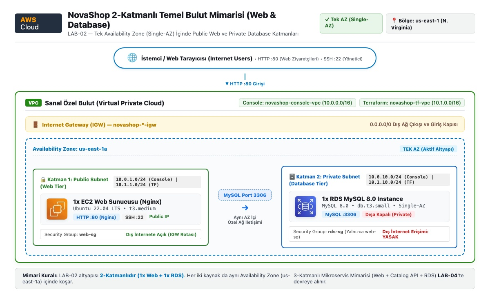

# LAB-02 — AWS Temel Altyapı ve Terraform IaC: 2-Katmanlı Mimari (Web & Database)

Bu laboratuvar, NovaShop e-ticaret uygulamasının 2-katmanlı temel altyapısını (Web Katmanı ve Veritabanı Katmanı) AWS üzerinde hem AWS Yönetim Konsolu (Web UI) hem de **HashiCorp Terraform** ile modüler olarak kurmanızı sağlar.

---

## 🏛️ Mimari Şema

Kurulan altyapı bileşenleri:
- **VPC (10.1.0.0/16):** Konsol ortamından (`10.0.0.0/16`) izole edilmiş bağımsız sanal ağ.
- **Public Subnet (10.1.1.0/24):** İnternet Gateway (IGW) bağlantılı EC2 Web Sunucusu (`t3.medium`, Nginx).
- **Private Subnets (10.1.10.0/24 & 10.1.11.0/24):** Dış dünyaya tamamen kapalı Single-AZ RDS MySQL (`db.t3.small`) ve DB Subnet Group.
- **Güvenlik Grupları (Security Groups):** Dışarıdan sadece HTTP (80) ve SSH (22) erişimi; RDS veritabanına sadece EC2 Web katmanından erişim.



---

## 📁 Dizin Yapısı

```text
labs/LAB-02/
├── README.md                      # Ana lab kılavuzu
└── terraform-basic-infra/
    ├── README.md                  # Bu kılavuz
    ├── backend.tf                 # S3 Remote State backend tanımı
    ├── provider.tf                # AWS provider ve etiketler
    ├── variables.tf               # Genel değişkenler (Region, CIDR, Instance tipleri)
    ├── main.tf                    # Modülleri bağlayan ana orkestrasyon dosyası
    ├── outputs.tf                 # EC2 IP, DNS ve RDS çıktıları
    ├── run.sh                     # [ÖNERİLEN] Dinamik, tek komutla sıfır dokunuş kurulum scripti
    ├── destroy.sh                 # [ÖNERİLEN] Dinamik, tek komutla kaynak imha scripti
    ├── terraform.tfvars.example   # Değişken konfigürasyon şablonu
    └── modules/
        ├── vpc/                   # VPC, Subnetler, IGW ve Route Table
        ├── security/              # Web ve DB Security Groupları
        ├── ec2/                   # Nginx + Türkçe UTF-8 web katmanı
        └── rds/                   # MySQL 8.0 RDS instance ve Subnet Group
```

---

## 🚀 Standart Kurulum (Terraform CLI - Adım Adım)

### 1. Çalışma Dizinine Geçin
```bash
cd ~/novashop/labs/LAB-02/terraform-basic-infra
```

### 2. AWS Kimlik Bilgilerini Doğrulayın
AWS kimlik bilgilerinizi `aws configure` ile tanımlamış olmanız veya ortam değişkeni olarak export etmeniz gerekir:

```bash
# Seçenek A: aws configure ile (Önerilen)
aws configure

# Seçenek B: Ortam değişkenleri ile
export AWS_ACCESS_KEY_ID="AKIAxxxxxxxxxxxxxxxx"
export AWS_SECRET_ACCESS_KEY="xxxxxxxxxxxxxxxxxxxxxxxxxxxxxxxxxxxxxxxx"
export AWS_DEFAULT_REGION="us-east-1"

# Kimliği doğrulayın:
aws sts get-caller-identity
```

### 3. Değişken Dosyasını Oluşturun
```bash
cp terraform.tfvars.example terraform.tfvars
```

### 4. S3 tfstate Bucket ve SSH Key Pair Oluşturun (ÖNEMLİ)
Terraform S3 backend kullanmaktadır. Bu nedenle başlamadan önce AWS hesap numaranıza özel bir bucket ve EC2 için SSH key pair oluşturulmalıdır:

```bash
# 1. AWS Hesap numarasını al ve S3 bucket adını belirle
ACCOUNT_ID=$(aws sts get-caller-identity --query Account --output text)
BUCKET_NAME="novashop-tfstate-${ACCOUNT_ID}"
echo "Kullanılacak S3 Bucket: $BUCKET_NAME"

# 2. S3 bucket'ı oluştur ve versiyonlamayı aç
aws s3api create-bucket --bucket "$BUCKET_NAME" --region us-east-1
aws s3api put-bucket-versioning --bucket "$BUCKET_NAME" --versioning-configuration Status=Enabled

# 3. EC2 için 'novashop-key' SSH anahtar çiftini oluştur (yoksa)
aws ec2 describe-key-pairs --key-names novashop-key --region us-east-1 >/dev/null 2>&1 || \
aws ec2 create-key-pair --key-name novashop-key --query "KeyMaterial" --output text --region us-east-1 > ~/.ssh/novashop-key.pem && chmod 400 ~/.ssh/novashop-key.pem
```

### 5. Terraform'u Başlatın (init) ve Altyapıyı Kurun (apply)
```bash
# S3 backend bucket adını dinamik olarak vererek başlatın:
terraform init -reconfigure -backend-config="bucket=$BUCKET_NAME"

# Planı inceleyin:
terraform plan

# Kaynakları oluşturun:
terraform apply -auto-approve
```

### 6. Doğrulama
```bash
# Sağlık kontrolü
curl -i $(terraform output -raw health_check_url)

# Web mağazası
curl -s $(terraform output -raw storefront_url)
```

---

## 🎁 BONUS: Tek Komutla Sıfır Dokunuş (Zero-Touch) Otomasyonu

Yukarıdaki tüm adımları (AWS kimlik kontrolü, hesap çözme, S3 bucket açma, SSH key oluşturma, tfvars hazırlama, init ve apply) tek dokunuşla otomatikleştiren **`run.sh`** scriptini kullanabilirsiniz. Script hiçbir şeyi hardcode etmez; AWS CLI oturumunuzdan bilgileri dinamik olarak çeker.

### Tek Komutla Çalıştırma:
```bash
cd ~/novashop/labs/LAB-02/terraform-basic-infra

# Kurulumu başlatın:
./run.sh
```

---

## 🧹 Kaynakları Temizleme (Destroy)

Laboratuvar sonrasında AWS üzerinde maliyet oluşmasını önlemek için kaynakları silmeyi unutmayın:

* **Otomasyon Scripti ile (Önerilen):**
  ```bash
  ./destroy.sh
  ```

* **Standart Terraform CLI ile:**
  ```bash
  terraform destroy -auto-approve
  ```
