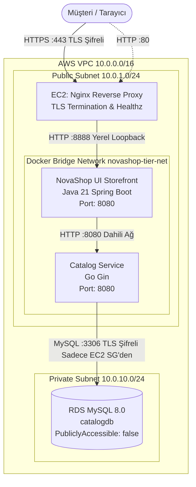

# LAB-04-AWS-3TIER — AWS 3-Tier Mimari: Docker Compose, Private RDS ve TLS Dağıtımı

| Seviye | Profil / Araçlar | Açık Portlar |
|---|---|---|
| Orta | Docker Compose, Nginx, AWS EC2, AWS RDS MySQL | 80 (HTTP), 443 (HTTPS), 19001 / 8888 (UI), 3306 (MySQL Private) |

---

### Amaç

AWS üzerinde izole bir VPC içerisinde; public subnet'teki EC2 üzerinde Docker Compose ile NovaShop UI ve Catalog mikroservislerini çalıştırmak, Catalog servisini private subnet'teki RDS MySQL veritabanına bağlamak ve Nginx ters vekili üzerinde TLS/HTTPS sertifikası ile güvenli, uçtan uca çalışan 3-katmanlı kurumsal bir e-ticaret altyapısı kurup rollback mekanizmasını doğrulamak.

---

### Kazanımlar

- 3-Katmanlı (Presentation, Application, Database) bulut mimarisini mikroservis konteynerleri ile hayata geçirmek.
- Konteynerize Catalog servisi (Go) ile private subnet'teki RDS MySQL veritabanını güvenli ortam değişkenleri (`.env`) ile bağlamak.
- Nginx üzerinde TLS/HTTPS (SSL) sonlandırması ve HTTP'den HTTPS'e otomatik yönlendirme yapılandırmak.
- Mikroservisler arası dahili container bridge ağı (`novashop-tier-net`) kurarak yalnızca gerekli portları dış dünyaya açmak.
- Yeni bir sürüm dağıtımında hata oluştuğunda çalışan önceki sürüme geri dönmeyi sağlayan kontrollü Rollback mekanizmasını uygulamak.
- Ortam değişkenlerini (`.env`) merkezi yöneterek komut satırında hard-coded değer girmeden kolay kopyala-yapıştır ile operasyon yürütmek.

---

### Ön koşullar

- **Önceki Lablar:** [LAB-02](../LAB-02/README.md) ve [LAB-03](../LAB-03/README.md) tamamlanmış olmalıdır.
- **Aktif AWS Kaynakları:**
  - Çalışır durumda 1 adet VPC (10.0.0.0/16) ve Internet Gateway.
  - Public Subnet içinde 1 adet EC2 Ubuntu 22.04 LTS sunucusu (`novashop-web-sg` grubunda).
  - Private Subnet içinde 1 adet RDS MySQL veritabanı (`catalogdb` kurulu, `novashop-rds-sg` grubunda).
- **Yerel Ortam:** SSH anahtarı (`.pem`), AWS CLI (veya CloudShell).

---

### Mimari ve Çalışma Modeli



---

### Ortam Değişkenleri ve Konfigürasyon Dosyası (.env)

Bu laboratuvardaki tüm komutların kopyala-yapıştır ile doğrudan çalışabilmesi için parametreler `.env` dosyasında tanımlanır.

#### 1. Yerel Terminalde Değişkenleri Tanımlama

Yerel bilgisayarınızda veya CloudShell'de lab klasörüne geçin ve `.env` dosyanızı oluşturun:

```bash
cd labs/LAB-04
cp .env.example .env
```

`.env` dosyasını kendi AWS ve RDS değerlerinizle güncelleyin (`nano .env`):

```bash
# --- AWS ve EC2 Bilgileri ---
AWS_REGION="us-east-1"
EC2_PUBLIC_IP="3.120.45.67"
KEY_PATH="~/.ssh/novashop-key.pem"
WEB_SG_ID="sg-0123456789abcdef0"

# --- RDS MySQL Parametreleri ---
RDS_ENDPOINT="novashop-catalog-db.cxxxx.rds.amazonaws.com"
DB_PORT="3306"
DB_NAME="catalogdb"
DB_USER="novashop"
DB_PASSWORD="YourStrongPassword123!"

# --- Domain / Host ---
DOMAIN="${EC2_PUBLIC_IP}"
```

Değişkenleri terminal oturumunuza aktarın:

```bash
set -a && source .env && set +a
```

> [!TIP]
> `set -a && source .env && set +a` komutu `.env` içindeki tüm değişkenleri `export` eder. Böylece aşağıdaki tüm komutları parametre değiştirmeden doğrudan kopyalayıp çalıştırabilirsiniz.

---

### Adım Adım Uygulama Rehberi

#### 1. Güvenlik Grubunda HTTPS (Port 443) Açma

Yerel terminalinizden veya AWS CloudShell üzerinden EC2 Web Güvenlik Grubuna HTTPS izni ekleyin:

```bash
aws ec2 authorize-security-group-ingress \
  --group-id "$WEB_SG_ID" \
  --protocol tcp --port 443 \
  --cidr 0.0.0.0/0 \
  --region "$AWS_REGION"
```

---

#### 2. EC2 Sunucusuna Bağlanma ve Docker/Compose Kurulumu

EC2 sunucusuna SSH ile bağlanın:

```bash
chmod 400 "$KEY_PATH"
ssh -i "$KEY_PATH" ubuntu@"$EC2_PUBLIC_IP"
```

Sunucuya ilk kez bağlanıyorsanız Docker ve Docker Compose eklentisini kurun:

```bash
sudo apt-get update -y
sudo apt-get install -y ca-certificates curl gnupg

# Docker resmi reposunu ekle
sudo install -m 0755 -d /etc/apt/keyrings
curl -fsSL https://download.docker.com/linux/ubuntu/gpg | sudo gpg --dearmor -o /etc/apt/keyrings/docker.gpg
sudo chmod a+r /etc/apt/keyrings/docker.gpg

echo "deb [arch="$(dpkg --print-architecture)" signed-by=/etc/apt/keyrings/docker.gpg] https://download.docker.com/linux/ubuntu \
  "$(. /etc/os-release && echo "$VERSION_CODENAME")" stable" | sudo tee /etc/apt/sources.list.d/docker.list > /dev/null

sudo apt-get update -y
sudo apt-get install -y docker-ce docker-ce-cli containerd.io docker-buildx-plugin docker-compose-plugin nginx
sudo usermod -aG docker ubuntu
newgrp docker
```

Doğrulama:
```bash
docker --version
docker compose version
```

---

#### 3. Proje Dosyalarını Hazırlama ve Ortam Değişkenleri

EC2 üzerinde repo klasörüne geçin (veya repoyu klonlayın):

```bash
git clone https://gitlab.com/devops-practitioner-labs/novashop.git ~/novashop || (cd ~/novashop && git pull)
cd ~/novashop/labs/LAB-04
```

Sunucu için `.env` dosyasını oluşturun:

```bash
cp .env.example .env
nano .env   # RDS_ENDPOINT ve DB_PASSWORD değerlerini girip kaydedin
chmod 600 .env
set -a && source .env && set +a
```

Klasör içeriğindeki hazır üretim dosyaları:
- `docker-compose.prod.yml`: UI ve Catalog servislerini izole `novashop-tier-net` bridge ağında kaynak limitleriyle çalıştırır.
- `novashop-3tier.conf`: HTTP->HTTPS 301 yönlendirmesi, SSL sonlandırması ve loopback ters vekil yapılandırması.
- `setup-tls.sh`: Kendinden imzalı TLS sertifikasını üretir ve Nginx'i devreye alır.
- `deploy.sh`: Docker Compose ile servisleri başlatır ve sağlık durumunu raporlar.
- `rollback.sh`: Hatalı imaj durumunda anında stabil sürüme döner.

---

#### 4. Üretim Düzeyi Docker Compose Dağıtımı

Servisleri tek komutla başlatın:

```bash
docker compose -f docker-compose.prod.yml up -d
```
*(Alternatif olarak hazır betiği kullanabilirsiniz: `./deploy.sh`)*

**Konteynerlerin Sağlık Durumunu İzleyin:**
```bash
docker compose -f docker-compose.prod.yml ps
```
*Beklenen çıktı (yaklaşık 20-30 saniye sonra):*
```text
NAME                   IMAGE                                                  STATUS                    PORTS
novashop-catalog-prod  .../retail-store-sample-catalog:1.6.2                  Up (healthy)              8080/tcp
novashop-ui-prod       .../retail-store-sample-ui:1.6.2                       Up (healthy)              127.0.0.1:8888->8080/tcp
```

**Katalog Servisi Loglarını ve Veritabanı Bağlantısını Kontrol Edin:**
```bash
docker logs novashop-catalog-prod | head -n 20
```
*Beklenen çıktı:* `Using mysql database ... Running database migration ... Database migration complete`.

---

#### 5. TLS Sertifikası ve Nginx HTTPS Yapılandırması

TLS sertifikasını üretmek ve Nginx ters vekilini kurmak için hazır kurulum betiğini çalıştırın:

```bash
./setup-tls.sh
```

Bu betik otomatik olarak:
1. `/etc/ssl/novashop/` altında 2048-bit RSA kendinden imzalı TLS sertifikası üretir.
2. `novashop-3tier.conf` dosyasını `/etc/nginx/conf.d/` altına kopyalar.
3. `nginx -t` ile sözdizimini doğrular ve Nginx servisini yeniden başlatır.

---

### Doğal Doğrulama ve Beklenen Sonuç

Yerel bilgisayarınızdan (veya sunucu dışından) testleri gerçekleştirin:

```bash
# 1. HTTP -> HTTPS 301 Yönlendirme Testi
curl -s -I "http://${EC2_PUBLIC_IP}/" | grep -E "(HTTP|Location)"
```
*Beklenen çıktı:*
```text
HTTP/1.1 301 Moved Permanently
Location: https://3.120.45.67/
```

```bash
# 2. HTTPS Sağlık Kontrolü (Kendinden imzalı sertifika için -k / --insecure)
curl -s -k "https://${EC2_PUBLIC_IP}/healthz"
```
*Beklenen çıktı:*
```json
{"status":"UP","tier":"3-tier-edge","protocol":"https"}
```

```bash
# 3. HTTPS Üzerinden Mağaza Sayfası İçerik Kontrolü
curl -s -k "https://${EC2_PUBLIC_IP}/" | grep -i "store"
```

```bash
# 4. Otomatik Laboratuvar Doğrulama Betiğini Çalıştırma
bash ../../scripts/verify/verify-lab-04.sh "$EC2_PUBLIC_IP" --insecure
```
*Beklenen çıktı:*
```text
=== [LAB-04] Doğrulama Başlatılıyor: 3.120.45.67 ===
1. HTTP (Port 80) -> HTTPS yönlendirme testi...
✅ HTTP -> HTTPS yönlendirmesi başarılı (HTTP 301).
2. HTTPS üzerinden ana sayfa ve NovaShop marka kontrolü...
✅ HTTPS erişimi ve marka başlığı ('NovaShop DevOps Store') doğrulandı.
3. HTTPS /actuator/health sağlık kontrolü...
✅ Actuator sağlık kontrolü başarılı: {"status":"UP"}
✅ HTTPS Favicon HTTP 200 OK.
=== [LAB-04] Tüm 3-Tier Doğrulamaları Başarılı! ===
```

---

### Kontrollü Sürüm Güncelleme ve Rollback Mekanizması

Hatalı bir imaj dağıtıldığında veya acil geri dönüş gerektiğinde hazır rollback betiğini çalıştırın:

```bash
./rollback.sh
```

*Beklenen çıktı:*
```text
=== NovaShop Acil Rollback Başlatılıyor ===
Geri dönülecek stabil UI imajı: public.ecr.aws/aws-containers/retail-store-sample-ui:1.6.2
Rollback tamamlandı. Konteyner durumu:
novashop-ui-prod ... Up (healthy)
```

---

### Troubleshooting

#### Senaryo 1: Catalog Servisi RDS'e Bağlanamıyor (`dial tcp ...:3306: i/o timeout`)
- **Belirti:** `docker logs novashop-catalog-prod` çıktısında `failed to connect database: dial tcp <RDS_ENDPOINT>:3306: i/o timeout` hatası.
- **Muhtemel Neden:** RDS Security Group (`novashop-rds-sg`) kuralında EC2 Security Group kimliğinin eksik olması veya yanlış yazılması.
- **Teşhis Komutu:**
  ```bash
  docker exec -it novashop-catalog-prod nc -zv "$RDS_ENDPOINT" 3306
  ```
- **Güvenli Çözüm:** AWS konsolundan veya CLI ile `novashop-rds-sg` güvenlik grubunda port 3306'nın kaynağının `novashop-web-sg` olduğunu teyit edin.

#### Senaryo 2: UI Servisi Açılmıyor veya Catalog'u Göremiyor (`502 Bad Gateway`)
- **Belirti:** Tarayıcıda ürünler yüklenmiyor veya UI loglarında `Connection refused` görünüyor.
- **Muhtemel Neden:** Catalog servisi sağlıklı (`healthy`) duruma geçmeden UI'ın başlamış olması veya `novashop-tier-net` köprü ağı tanımlama hatası.
- **Teşhis Komutu:**
  ```bash
  docker inspect novashop-catalog-prod --format '{{.State.Health.Status}}'
  docker exec -it novashop-ui-prod curl -s http://catalog:8080/health
  ```
- **Güvenli Çözüm:** `docker-compose.prod.yml` içinde `depends_on.catalog.condition: service_healthy` tanımlandığından emin olun ve konteynerleri yeniden başlatın: `docker compose -f docker-compose.prod.yml restart`.

#### Senaryo 3: Nginx SSL Sertifika Hatası (`SSL_ERROR_RX_RECORD_TOO_LONG`)
- **Belirti:** Tarayıcı veya curl `SSL_ERROR_RX_RECORD_TOO_LONG` hatası veriyor.
- **Muhtemel Neden:** Port 443 bloğunda `ssl` anahtar kelimesinin unutulmuş olması (`listen 443;` yerine `listen 443 ssl;` olmalıdır).
- **Teşhis Komutu:**
  ```bash
  sudo nginx -t
  grep -rn "listen 443" /etc/nginx/
  ```
- **Güvenli Çözüm:** `setup-tls.sh` betiğini çalıştırarak doğru konfigürasyonun aktif olduğundan emin olun.

---

### Güvenlik Notu

1. **İç Ağ İzolasyonu:**
   - Catalog servisi dış dünyaya (`0.0.0.0/0`) hiçbir port açmaz; yalnızca Docker iç ağı (`novashop-tier-net`) üzerinden UI servisiyle konuşur.
   - UI servisi yalnızca `127.0.0.1:8888` üzerinden EC2 loopback adresinde dinler; dış dünya doğrudan erişemez, yalnızca Nginx üzerinden HTTPS ile erişir.
2. **TLS Zorunluluğu:**
   - Port 80 gelen tüm istekler HTTP 301 kodu ile HTTPS port 443'e zorla yönlendirilir.
   - Güçlü HSTS (`Strict-Transport-Security`) başlığı eklenmiştir.
3. **Secret Yönetimi:**
   - `.env` dosyası `chmod 600` ile korunur ve `.gitignore` içinde yer alır. Asla Git deposuna commit edilmez.

---

### Cleanup

Laboratuvarı tamamladıktan sonra kaynakları temizlemek için:

```bash
# 1. Konteynerleri ve ağı kaldır
docker compose -f docker-compose.prod.yml down -v

# 2. TLS sertifikalarını ve Nginx konfigürasyonunu temizle
sudo rm -rf /etc/ssl/novashop /etc/nginx/conf.d/novashop-3tier.conf
sudo systemctl restart nginx
```
