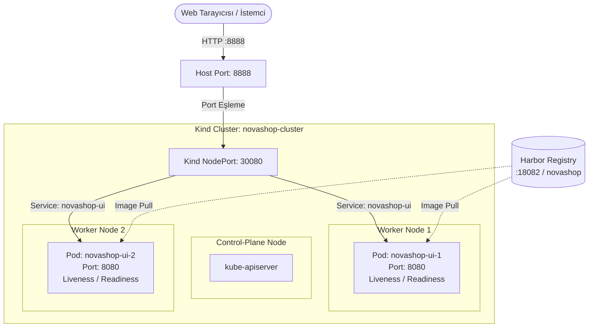

# LAB-06-KUBERNETES-HELM — Kind Üzerinde Kubernetes Core ve Helm ile Mikroservis Dağıtımı

| Seviye | Profil / Araçlar | Açık Portlar |
|---|---|---|
| Orta | Kind K8s, kubectl, Helm v3, Harbor | 19001 / 30080 (UI NodePort), 18084 (Headlamp), 18444 / 18082 (Harbor) |

---

### Amaç

Sanal makinede bağımsız bir çalışma dizininde Kind (Kubernetes IN Docker) ile çok düğümlü (1 control-plane, 2 worker) yerel bir Kubernetes kümesi kurmak; NovaShop mikroservis imajını Harbor Registry'den (veya yerel küme yüklemesiyle) çekerek Helm paket yöneticisi ile dağıtmak, sağlık problarını doğrulamak ve kesintisiz sürüm güncelleme (`helm upgrade`) ile geri alma (`helm rollback`) adımlarını uygulamak.

---

### Kazanımlar

- Kind ile çok düğümlü yerel Kubernetes kümesini bağımsız bir dizinde kurup `kubectl` ile yönetmek.
- İmajları yerel Harbor OCI Registry üzerinden Kubernetes ortamına taşımak (veya `kind load` mekanizmasını kullanmak).
- Helm Chart yapısını (`Chart.yaml`, `values.yaml`, `templates/`) kavramak ve ortama özel `values-dev.yaml` ile dağıtım yapmak.
- Container sağlık problarını (`livenessProbe` ve `readinessProbe`) Spring Boot Actuator endpoint'leri ile doğrulamak.
- Helm ile kesintisiz sürüm güncelleme (`helm upgrade`), revizyon takibi (`helm history`) ve geri alma (`helm rollback`) süreçlerini uygulamak.

---

### Ön Koşullar

1. **Önceki Lablar:** [LAB-01](../LAB-01/README.md) ve [LAB-03](../LAB-03/README.md) tamamlanmış olmalıdır.
2. **Harbor Registry:** [Platform Hazırlık - Harbor Kurulumu](../LAB-00-PLATFORM-SETUP/02-harbor-setup.md) tamamlanmış olmalıdır.
   - Harbor Web Erişimi: `http://<UBUNTU_IP>:18444` (veya `:18082`)
   - Proje Adı: `novashop` (Public olarak açılmış olmalıdır)
   - Docker Girişi: `docker login <UBUNTU_IP>:18444 -u admin -p Harbor12345` (veya `:18082`)
   - *(Not: Ortamınızda Harbor henüz hazır değilse, Adım 3'teki alternatif `kind load` yöntemiyle devam edebilirsiniz).*
3. **Yüklü Araçlar:** Docker v24+, `kubectl`, `kind`, `helm` v3+.
4. **Sistem Kaynağı:** En az 2 vCPU ve 6 GB boş RAM.

---

### Mimari



---

### Kullanılan Değişkenler

| Değişken | Açıklama | Örnek |
|---|---|---|
| `<UBUNTU_IP>` | Sanal makinenizin yerel IP adresi | `192.168.1.100` veya `10.0.2.15` |
| `<CLUSTER_NAME>` | Kind küme adı | `novashop-cluster` |
| `<NAMESPACE>` | Kubernetes isim alanı | `novashop` |

---

### Adımlar

#### Adım 1: CLI Araçlarının Doğrulanması

Gerekli araçların kurulu olduğunu teyit edin:

```bash
kubectl version --client
kind version
helm version --short
```

*Beklenen çıktı:* Tüm araçların sürüm numaraları hatasız listelenmelidir.

---

#### Adım 2: Bağımsız Dizin Üzerinde Kind Kümesini Başlatma

> [!IMPORTANT]
> Kind küme konfigürasyonu proje reposunun içine konulmamalı, bağımsız bir dizinde (`~/kind`) yönetilmelidir.

1. Bağımsız `~/kind` dizinini oluşturun ve içine geçin:
   ```bash
   cd ~
   mkdir -p ~/kind && cd ~/kind
   ```

2. Host üzerinde log dizinlerini hazırlayın (LAB-11 Fluent Bit log entegrasyonu için):
   ```bash
   sudo mkdir -p /var/log/containers /var/log/pods
   sudo chmod 777 /var/log/containers /var/log/pods
   ```

3. 1 control-plane ve 2 worker düğümlü hafif küme konfigürasyonunu (`kind-config.yaml`) oluşturun:
   ```bash
   cat << 'EOF' > kind-config.yaml
   kind: Cluster
   apiVersion: kind.x-k8s.io/v1alpha4
   name: novashop-cluster
   nodes:
   - role: control-plane
     extraPortMappings:
     - containerPort: 30080
       hostPort: 30080
       listenAddress: "0.0.0.0"
   - role: worker
     extraMounts:
     - hostPath: /var/log/containers
       containerPath: /var/log/containers
     - hostPath: /var/log/pods
       containerPath: /var/log/pods
   - role: worker
     extraMounts:
     - hostPath: /var/log/containers
       containerPath: /var/log/containers
     - hostPath: /var/log/pods
       containerPath: /var/log/pods
   EOF
   ```
   *Açıklama:*
   - Host makinenin `30080` portu, Kubernetes içerisindeki `30080` NodePort portuna doğrudan eşlenir. Böylece LAB-03 Docker UI (`:8888`) ile port çakışması yaşanmaz ve her iki ortam aynı anda çalışabilir.
   - `/var/log/containers` ve `/var/log/pods` dizinleri hosttan worker düğümlerine bağlanarak, LAB-11'deki Fluent Bit log toplayıcısının pod loglarını doğrudan okuyabilmesi sağlanır.

4. Kind kümesini oluşturun:
   ```bash
   kind create cluster --config kind-config.yaml
   ```

4. Düğümlerin hazır olduğunu doğrulayın:
   ```bash
   kubectl get nodes
   ```
   *Beklenen çıktı:* 1 control-plane ve 2 worker düğümü `Ready` durumunda görünmelidir.

---

#### Adım 3: İmajın Hazırlanması ve Kümeye Sağlanması

NovaShop UI mikroservis imajını hazırlayın.

1. Proje dizinine geçin:
   ```bash
   cd ~/novashop
   ```

2. İmajı yerel olarak derleyin (LAB-03'te derlemediyseniz):
   ```bash
   docker build -t novashop-ui:v0.1.0 src/ui
   ```

##### Seçenek A: Harbor Registry ile Dağıtım (Ön Koşul — Standart Yol)

Harbor kurulu ve çalışır durumdaysa:

1. İmajı Harbor formatında etiketleyin (`<UBUNTU_IP>` yerine sunucu IP'nizi yazın):
   ```bash
   docker tag novashop-ui:v0.1.0 <UBUNTU_IP>:18082/novashop/ui:v0.1.0
   ```

2. İmajı Harbor'a gönderin:
   ```bash
   docker push <UBUNTU_IP>:18082/novashop/ui:v0.1.0
   ```

3. Kind kümesinin imajı anında ve sorunsuz görebilmesi için küme düğümlerine yükleyin:
   ```bash
   kind load docker-image <UBUNTU_IP>:18082/novashop/ui:v0.1.0 --name novashop-cluster
   ```

##### Seçenek B: Harbor Yoksa Doğrudan Kind'a Yükleme (Alternatif)

Harbor ortamınız henüz hazır değilse, imajı doğrudan Kind kümesine yükleyerek devam edebilirsiniz:

```bash
kind load docker-image novashop-ui:v0.1.0 --name novashop-cluster
```

---

#### Adım 4: Kubernetes İsim Alanı (Namespace) Oluşturma

Uygulama kaynaklarını izole etmek için `novashop` isim alanını oluşturun:

```bash
kubectl create namespace novashop
kubectl config set-context --current --namespace=novashop
```

---

#### Adım 5: Helm Chart ile NovaShop Mikroservisini Dağıtma

1. Repo içindeki Helm chart dizinini inceleyin:
   ```bash
   cd ~/novashop
   ls -la charts/novashop/
   ```

2. Dağıtım için `values-dev.yaml` dosyasını oluşturun:

   **Seçenek A (Harbor Kullanıyorsanız):**
   ```bash
   cat << 'EOF' > values-dev.yaml
   catalog:
     enabled: false

   ui:
     enabled: true
     replicaCount: 2
     image:
       repository: <UBUNTU_IP>:18082/novashop/ui
       tag: v0.1.0
       pullPolicy: IfNotPresent
   EOF
   ```
   *(Not: `<UBUNTU_IP>` yerine sunucu IP adresinizi yazınız).*

   **Seçenek B (Harbor Yoksa / Yerel `kind load` ile Devam Ediyorsanız):**
   ```bash
   cat << 'EOF' > values-dev.yaml
   catalog:
     enabled: false

   ui:
     enabled: true
     replicaCount: 2
     image:
       repository: novashop-ui
       tag: v0.1.0
       pullPolicy: IfNotPresent
   EOF
   ```

3. Helm ile uygulamayı dağıtın (`helm install`):
   ```bash
   helm install novashop ./charts/novashop -f values-dev.yaml -n novashop
   ```

4. Dağıtım durumunu Helm üzerinden kontrol edin:
   ```bash
   helm list -n novashop
   ```
   *Beklenen çıktı:* `STATUS: deployed`, `REVISION: 1` görünmelidir.

---

#### Adım 6: Pod ve Servis Sağlık Durumlarını Doğrulama

1. Pod'ların ayağa kalktığını ve `Running` durumunda olduğunu kontrol edin:
   ```bash
   kubectl get pods -n novashop -o wide
   ```
   *Beklenen çıktı:* 2 adet `novashop-ui-...` pod'u `1/1 Running` olmalıdır.

2. Servisin oluşturulduğunu ve NodePort'u doğrulayın:
   ```bash
   kubectl get svc -n novashop
   ```
   *Beklenen çıktı:* `novashop-ui` servisi `NodePort` tipinde ve `8080:30080/TCP` port eşlemesiyle görünmelidir.

3. Dış dünyadan sağlık endpoint'ini test edin (Host 30080 -> NodePort 30080):
   ```bash
   curl -s http://localhost:30080/actuator/health
   ```
   *Beklenen çıktı:*
   ```json
   {"status":"UP"}
   ```

   > **Tarayıcıdan İnceleme (Erişim Seçenekleri):**  
   > * **Model A (Doğrudan IP:Port — Standart & Varsayılan):** `http://<UBUNTU_IP>:30080` (DNS ve SSL gerektirmez)  
   > * **Model B (DNS + Wildcard SSL):** `https://<SUBDOMAIN>-k8s.<DOMAIN_NAME>` (Nginx Edge Proxy yapılandırıldıysa)  
   > Web tarayıcınızdan yukarıdaki adreslerden biriyle Kubernetes üzerindeki NovaShop mikroservisini canlı olarak görüntüleyin.

---

#### Adım 7: Helm ile Sıfır Kesintili Güncelleme ve Geri Alma (Rollback)

1. **Sürüm Güncelleme (`helm upgrade`):**  
   Replica sayısını 2'den 3'e yükseltin:
   ```bash
   helm upgrade novashop ./charts/novashop -f values-dev.yaml --set ui.replicaCount=3 -n novashop
   ```

2. Pod'ların kesintisiz olarak 3'e yükseldiğini doğrulayın:
   ```bash
   kubectl rollout status deployment/novashop-ui -n novashop
   kubectl get pods -n novashop
   ```

3. **Helm Dağıtım Geçmişini İnceleme (`helm history`):**
   ```bash
   helm history novashop -n novashop
   ```
   *Beklenen çıktı:* 2 adet revizyon (`REVISION 1` ve `REVISION 2`) listelenmelidir.

4. **Hata Durumunda Geri Alma (`helm rollback`):**  
   Revizyon 1'e geri dönün:
   ```bash
   helm rollback novashop 1 -n novashop
   ```

5. Pod sayısının tekrar 2'ye indiğini doğrulayın:
   ```bash
   kubectl rollout status deployment/novashop-ui -n novashop
   kubectl get pods -n novashop
   ```

---

#### Adım 8: Otomatik Doğrulama Betiğini Çalıştırma

Tüm lab gereksinimlerini otomatik test betiği ile doğrulayın:

```bash
cd ~/novashop
bash scripts/verify/verify-lab-06.sh
```

*Beklenen çıktı:*
```text
=== [LAB-06] Kubernetes ve Helm Doğrulama Başlatılıyor ===
✅ Helm chart dizini mevcut: .../charts/novashop
✅ Tüm temel Helm chart şablonları mevcut.
✅ Liveness ve Readiness sağlık probları tanımlı.
✅ Kaynak sınırları (resources.limits) tanımlı.
✅ Non-root kullanıcı güvenlik kuralı (runAsNonRoot: true) tanımlı.
✅ Helm lint başarıyla tamamlandı.
✅ Kubernetes kümesine erişim sağlandı.
=== [LAB-06] Kubernetes ve Helm Doğrulaması Tamamlandı! ===
```

---

### Temizlik (Cleanup)

Laboratuvar çalışması bittiğinde sanal makinedeki sistem kaynaklarını serbest bırakın:

```bash
# 1. Helm dağıtımını kaldırın
helm uninstall novashop -n novashop

# 2. Kind kümesini silin
kind delete cluster --name novashop-cluster

# 3. Kind geçici dizinini temizleyin
rm -rf ~/kind

# 4. Yerel test imajlarını temizleyin (isteğe bağlı)
docker rmi novashop-ui:v0.1.0 2>/dev/null || true
```
