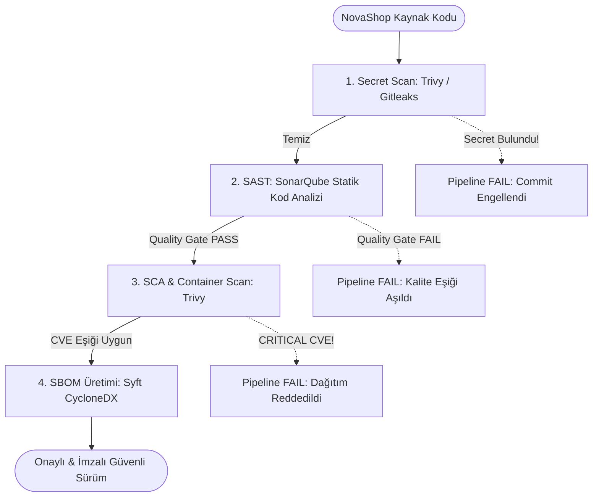

# LAB-08-SECURITY-GATES — DevSecOps: SonarQube, Trivy, Secret Scanning ve SBOM ile Güvenlik Kapıları

| Seviye | Profil / Araçlar | Açık Portlar |
|---|---|---|
| Orta | SonarQube, Trivy, Gitleaks, Syft/SBOM | 19000 (SonarQube) |

---

### Amaç

NovaShop kod tabanında statik kod analizi (SonarQube/SAST), bağımlılık ve konteyner zafiyet taraması (Trivy/SCA), parola/anahtar sızıntı denetimi (Secret Scanning) ve yazılım malzeme listesi (SBOM) üretimini otomatikleştirerek geçişi engelleyen veya onaylayan kurumsal Kalite Kapılarını (Quality Gates) doğrulamak.

---

### Kazanımlar

- CI/CD boru hattına "Shift-Left Security" (Güvenliği Sola Çekme) prensibiyle otomatik güvenlik denetimleri eklemek.
- SonarQube ile kod kokuları (Code Smells), potansiyel hatalar (Bugs) ve güvenlik açıkları için eşik değerler (Quality Gate) belirlemek.
- Trivy ile hem dosya sistemi (Filesystem) hem de Docker imajları üzerinde CVE taraması yapmak ve kritik zafiyet durumunda derlemeyi durdurmak (`--exit-code 1`).
- Repoya yanlışlıkla secret (parola, API token, özel anahtar) commit edilmesini engellemek için yerel ve CI tabanlı gizli bilgi tarayıcıları çalıştırmak.
- Syft / ORT araçları ile CycloneDX/SPDX formatında standart Yazılım Malzeme Listesi (SBOM - Software Bill of Materials) üretmek.

---

### Ön Koşullar ve Hızlı Başlangıç

Bu laboratuvar tek başına (standalone) çalıştırılabilir. Gerekli SonarQube altyapısı sunucuda halihazırda çalışmıyorsa aşağıdaki hızlı başlangıç komutlarıyla başlatabilirsiniz.

#### 1. Hızlı Başlangıç (SonarQube Servisini Başlatma)

```bash
# 1. Linux çekirdek Elasticsearch bellek sınırını ayarlayın:
sudo sysctl -w vm.max_map_count=524288

# 2. SonarQube ve PostgreSQL servislerini arka planda başlatın:
docker compose -f infra/sonarqube/docker-compose.yml up -d

# 3. Servisin hazır oluşunu kontrol edin (ilk açılış 45-60 saniye sürebilir):
curl -s http://127.0.0.1:19000/api/system/status || echo "SonarQube başlatılıyor..."
```

#### 2. Cockpit ve Erişim Modelleri

| Parametre | Değer / Açıklama |
|---|---|
| **Konteyner Portu** | `9000` (PostgreSQL `5432`) |
| **Cockpit / Nginx Portu** | `19000` |
| **Model A (Doğrudan IP)** | `http://<SUNUCU_IP>:19000` veya `http://127.0.0.1:19000` |
| **Model B (Cockpit / Kurumsal DNS)** | `https://${STUDENT_ID}-sonarqube.${DOMAIN_NAME}` |
| **Varsayılan Giriş** | Kullanıcı: `admin` \| Şifre: `admin` *(İlk girişte şifre güncelleme istenir)* |

---

### Mimari



---

### Ortam Değişkenleri ve Parametreler

Çalıştırmadan önce ortam değişkenlerini terminal oturumunuzda tanımlayın:

```bash
export STUDENT_ID="${STUDENT_ID:-student01}"
export DOMAIN_NAME="${DOMAIN_NAME:-example.com}"
export SUNUCU_IP="${SUNUCU_IP:-127.0.0.1}"

# SonarQube URL belirleme:
export SONAR_HOST_URL="http://127.0.0.1:19000"
# Kurumsal HTTPS DNS kullanılıyorsa:
# export SONAR_HOST_URL="https://${STUDENT_ID}-sonarqube.${DOMAIN_NAME}"
```

| Parametre | Açıklama | Örnek Değer |
|---|---|---|
| `${STUDENT_ID}` | Oturum / kullanıcı kimliği | `student01` |
| `${DOMAIN_NAME}` | Ana alan adı | `example.com` |
| `${SONAR_HOST_URL}` | SonarQube erişim adresi | `http://127.0.0.1:19000` veya `https://${STUDENT_ID}-sonarqube.${DOMAIN_NAME}` |
| `${SONAR_TOKEN}` | SonarQube kullanıcı / analiz tokeni | `squ_...` (Arayüzden veya API ile üretilir) |
| `${IMAGE_NAME}` | Taranacak Docker imajı | `novashop-ui:v0.1.0` |

---

### Adımlar

#### 1. Gizli Bilgi Taraması (Secret Scanning)

Repoda unutulmuş API anahtarları, şifreler veya sertifikaları tespit etmek için dosya sistemi tarayıcısını çalıştırın:

```bash
# Docker üzerinden izole Trivy ile secret taraması (Host üzerinde Trivy CLI gerektirmez):
docker run --rm -v $(pwd):/src aquasec/trivy:latest fs --security-checks secret /src
```
*Açıklama:* Çalışma dizinindeki dosyaları desen ve entropi kurallarıyla tarayarak açıkta kalan kimlik bilgilerini raporlar.  
*Beklenen çıktı:* `Secrets: 0` (Hiçbir secret bulunmamalıdır).

---

#### 2. SonarQube Statik Kod Analizi (SAST)

##### A. SonarQube Analiz Tokeni Alma

1. Web tarayıcısından SonarQube arayüzüne gidin:
   - **Model A:** `http://<SUNUCU_IP>:19000`
   - **Model B:** `https://${STUDENT_ID}-sonarqube.${DOMAIN_NAME}`
2. Kullanıcı adı `admin` ve şifre `admin` ile giriş yapın. İlk girişte şifrenizi güncelleyin (örnek: `SonarSecure123!`).
3. Sağ üstteki kullanıcı ikonuna tıklayın: **My Account > Security > Generate Token**.
   - **Name:** `novashop-token`
   - **Type:** `Global Analysis Token`
   - **Generate** butonuna tıklayın ve üretilen tokeni kopyalayın:
     ```bash
     export SONAR_TOKEN="<KOPYALANAN_TOKEN>"
     ```

> **Hızlı API Yöntemi (Arayüzsüz Token Üretimi):**
> Yeni şifrenizle doğrudan API üzerinden token oluşturabilirsiniz:
> ```bash
> export SONAR_TOKEN=$(curl -u admin:SonarSecure123! -s -X POST "http://127.0.0.1:19000/api/user_tokens/generate?name=novashop-token" | grep -o '"token":"[^"]*"' | cut -d'"' -f4)
> echo "Oluşturulan SonarQube Token: $SONAR_TOKEN"
> ```

##### B. Maven ile Statik Analizi Çalıştırma

**Yöntem 1: Yerel Maven İle (Java 21 yüklüyse):**
```bash
cd src/ui
./mvnw clean verify sonar:sonar \
  -Dsonar.projectKey=novashop-ui \
  -Dsonar.projectName='NovaShop UI' \
  -Dsonar.host.url=${SONAR_HOST_URL} \
  -Dsonar.token=${SONAR_TOKEN} \
  -Dsonar.qualitygate.wait=true
cd ../..
```

**Yöntem 2: Docker Tabanlı Maven İle (Yerelde Java/Maven kurulu değilse):**
```bash
docker run --rm --network host \
  -v $(pwd):/usr/src/novashop -w /usr/src/novashop/src/ui \
  maven:3.9-eclipse-temurin-21 \
  mvn clean verify sonar:sonar \
    -Dsonar.projectKey=novashop-ui \
    -Dsonar.projectName='NovaShop UI' \
    -Dsonar.host.url=${SONAR_HOST_URL} \
    -Dsonar.token=${SONAR_TOKEN} \
    -Dsonar.qualitygate.wait=true
```

*Açıklama:*
- `-Dsonar.qualitygate.wait=true`: SonarQube sunucusundaki analiz bitene kadar bekler; Kalite Kapısı koşulları (ör. 0 Güvenlik Açığı, %80 Kod Kapsamı) sağlanmazsa derlemeyi derhal başarısız (`BUILD FAILURE`) kılar.

---

#### 3. Trivy ile Konteyner İmaj Zafiyet Taraması (SCA)

1. Henüz derlenmediyse hedef mikroservis imajını derleyin:
   ```bash
   docker build -t novashop-ui:v0.1.0 -f src/ui/Dockerfile src/ui
   ```

2. İmajı işletim sistemi paketleri ve uygulama bağımlılıkları açısından tarayın:
   ```bash
   # Bilgilendirici genel rapor:
   docker run --rm -v /var/run/docker.sock:/var/run/docker.sock \
     aquasec/trivy:latest image novashop-ui:v0.1.0

   # Kalite Kapısı Modu: CRITICAL seviyeli açık varsa çıkış kodu 1 dönerek pipeline'ı durdur:
   docker run --rm -v /var/run/docker.sock:/var/run/docker.sock \
     aquasec/trivy:latest image --severity HIGH,CRITICAL --exit-code 1 novashop-ui:v0.1.0
   ```
*Açıklama:* Eğer imajda düzeltilmemiş kritik seviyeli bir CVE açığı varsa komut `1` koduyla sonlanır ve dağıtım engellenir.

---

#### 4. Yazılım Malzeme Listesi (SBOM) Üretimi

Uygulamanın içerdiği tüm açık kaynak kütüphaneleri, sürümleri ve lisansları içeren standart CycloneDX formatında SBOM oluşturun:

```bash
# Syft aracı ile JSON formatında SBOM üretimi:
docker run --rm -v /var/run/docker.sock:/var/run/docker.sock -v $(pwd):/out \
  anchore/syft:latest novashop-ui:v0.1.0 -o cyclonedx-json=/out/sbom.json

# İlk 25 satırı inceleyin:
head -n 25 sbom.json
```
*Açıklama:* Üretilen `sbom.json` dosyası denetim, uyumluluk (compliance) ve tedarik zinciri güvenliği (Supply Chain Security) kanıtı olarak saklanır.

---

#### 5. Başarılı ve Başarısız Kalite Kapısı Simülasyonu

**1. Başarısız Kapı Senaryosu (Fail Gate):**
Kasıtlı olarak test anahtarını repoya ekleyip tarayıcıyı çalıştırın:
```bash
echo "AWS_SECRET_ACCESS_KEY=AKIAIOSFODNN7EXAMPLE123456" > test_secret.env
docker run --rm -v $(pwd):/src aquasec/trivy:latest fs --security-checks secret --exit-code 1 /src
```
*Beklenen çıktı:* `Exit code 1 - CRITICAL: Secret found!` (Pipeline'ın kırmızıya dönerek dağıtımı engellediğini kanıtlar).

**2. Temizleme ve Başarılı Kapı Senaryosu (Pass Gate):**
```bash
rm -f test_secret.env
docker run --rm -v $(pwd):/src aquasec/trivy:latest fs --security-checks secret --exit-code 1 /src
```
*Beklenen çıktı:* `Exit code 0` (Kalite kapısı geçildi).

---

#### 6. Otomatik Laboratuvar Doğrulama Betiğini Çalıştırma

Kod tabanınızdaki gizli anahtarları, lisans uyumluluğunu ve Dockerfile non-root kontrollerini otomatik betik ile test edin:

```bash
bash scripts/verify/verify-lab-08.sh
```
*Beklenen çıktı:*
```text
=== [LAB-08] DevSecOps Güvenlik Kapıları Doğrulama Başlatılıyor ===
1. Hassas bilgi ve özel anahtar sızıntı taraması yapılıyor...
✅ Secret taraması temiz: Kod tabanında sızıntı tespit edilmedi.
2. Açık kaynak lisans ve atıf (Attribution) kontrolü...
✅ Ana depo LICENSE dosyası mevcut.
3. Dockerfile güvenlik sertleştirmesi (Non-root) denetleniyor...
✅ Non-root kullanıcı kuralları doğrulandı.
=== [LAB-08] DevSecOps Güvenlik Kapıları Doğrulaması Başarılı! ===
```

---

### Troubleshooting

#### Senaryo 1: Trivy Veritabanı İndirme Hatası (`download error: rate limit exceeded`)
- **Belirti:** `trivy image` çalıştırıldığında DB güncellemesinde zaman aşımı veya rate limit hatası alınması.
- **Güvenli Çözüm:** Yerel veritabanı önbelleğini kullanın veya GitHub token ortam değişkenini tanımlayın: `export GITHUB_TOKEN=<TOKEN>`.

#### Senaryo 2: SonarQube Konteyneri Başlamıyor (`max virtual memory areas vm.max_map_count [65530] is too low`)
- **Belirti:** `docker logs sonarqube` çıktısında Elasticsearch çökmesi görünmesi.
- **Güvenli Çözüm:** Çekirdek sınırını artırın:
  ```bash
  sudo sysctl -w vm.max_map_count=524288
  docker compose -f infra/sonarqube/docker-compose.yml restart sonarqube
  ```

#### Senaryo 3: SonarQube `Quality Gate failed: Coverage on New Code < 80%`
- **Belirti:** Kod güvenli olmasına rağmen test kapsamı eşiği aşılamadığı için analiz başarısız oluyor.
- **Teşhis:** SonarQube panelinde "Measures > Coverage" sekmesini inceleyin.
- **Güvenli Çözüm:** Yeni eklenen sınıflar veya metodlar için `src/test/java` altında birim test yazarak kapsamı artırın.

---

### Güvenlik Notu

1. **Shift-Left İlkesi:**
   - Güvenlik kontrolleri canlı ortam yerine geliştirici bilgisayarında (pre-commit hook) ve CI derleme aşamasında işletilir.
2. **Kritik Zafiyet İntoleransı:**
   - Bilinen `CRITICAL` seviyeli CVE açığına sahip hiçbir imaj üretim ortamına çıkamaz (`--exit-code 1`).

---

### Cleanup / Rollback

```bash
# 1. Üretilen SBOM ve geçici tarama dosyalarını silin
rm -f sbom.json test_secret.env

# 2. SonarQube servislerini durdurun (veriler sonarqube_data volume'unda saklanır)
docker compose -f infra/sonarqube/docker-compose.yml down
```

---

### Pratik Uygulama Görevi

1. Reponun `.gitignore` dosyasına `*.env`, `*.pem` ve `sbom.json` kurallarının eklendiğini teyit edin.
2. Git hooks (`.git/hooks/pre-commit`) içerisine `docker run --rm -v $(pwd):/src aquasec/trivy:latest fs --security-checks secret` çalıştıran bir komut ekleyerek secret içeren commit'leri yerelde engelleyin.
