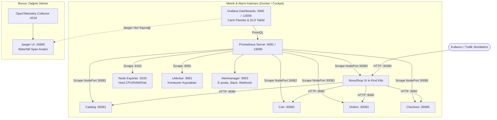

# LAB-10-OBSERVABILITY — İleri Gözlemlenebilirlik: Prometheus, Grafana, Alertmanager ve SRE (SLI/SLA/SLO) Yönetimi

| Seviye | Profil / Araçlar | Açık Portlar |
|---|---|---|
| Orta - İleri | Prometheus, Grafana, Alertmanager, Jaeger, OTel | 19090 / 9091 (Prometheus), 13000 / 3000 (Grafana), 9093 (Alertmanager), 16686 (Jaeger) |

---

### Amaç

NovaShop mikroservis ekosistemindeki tüm servisleri (**UI, Catalog, Cart, Orders, Checkout**); **Prometheus** ile zaman serisi metrik toplama (RED ve USE metotları), **Grafana** ile operasyonel izleme panoları ve canlı alarm kuralları tanımlama, **Alertmanager** ile çok kanallı alarm yönlendirme ve kontrollü yük oluşturarak **SRE Hizmet Seviyesi Hedefleri (SLO)** ile **Hata Bütçesi (Error Budget)** yönetimini hem komut satırından (CLI) hem de web kullanıcı arayüzünden (UI) uçtan uca doğrulamaktır.

Laboratuvarın **Bonus Bölümü** ile mikroservisler arası istek yolculuklarını izleyen **OpenTelemetry (OTel) Collector & Jaeger Distributed Tracing** altyapısı incelenir.

---

### Gözlemlenebilirlik ve SRE Temel İlkeleri

Modern bulut-yerlisi sistemlerin izlenmesinde 3 temel sütun ve 2 metodoloji esastır:

#### 1. Gözlemlenebilirliğin 3 Temel Sütunu (The Three Pillars)
* **Metrikler (Metrics):** Zaman içinde toplanan sayısal verilerdir (CPU %, istek sayısı, gecikme). Sistemin *"Şu anda bir sorun var mı?"* sorusuna en hızlı ve en hafif cevabı verir (Prometheus).
* **Günlükler (Logs):** Belirli bir zaman damgasında gerçekleşen tekil olay kayıtlarıdır. *"Ne oldu, hata mesajı nedir?"* sorusunu yanıtlar (ELK Stack / LAB-11).
* **İzler (Traces):** Tek bir kullanıcı isteğinin mikroservisler arasındaki uçtan uca yolculuğudur. *"Gecikme hangi mikroserviste ve hangi SQL sorgusunda yaşandı?"* sorusunu yanıtlar (Jaeger / OpenTelemetry).

#### 2. RED Metodu (Mikroservis ve İstek Odaklı İzleme)
* **R — Rate (İstek Hızı):** Saniyedeki istek sayısı (Requests per Second - RPS).
* **E — Errors (Hata Oranı):** Başarısız istek sayısı (özellikle HTTP 5xx ve 4xx durum kodları).
* **D — Duration (Gecikme / Süre):** İsteklerin yanıtlanma süresi (p50, p90, p95, p99 persentilleri).

#### 3. USE Metodu (Altyapı ve Kaynak Odaklı İzleme)
* **U — Utilization (Kullanım):** Kaynağın kullanım yüzdesi (Örn: %75 CPU, %80 RAM doluluğu).
* **S — Saturation (Doygunluk):** İşlenemeyip kuyrukta bekleyen iş miktarı (CPU Load Average, Disk I/O Wait).
* **E — Errors (Hatalar):** Donanım veya çekirdek düzeyindeki hata sayaçları (Ağ paket düşmesi, disk I/O hatası).

#### 4. SRE Sözlüğü (SLI, SLO, SLA, Error Budget)
* **SLI (Service Level Indicator):** Ölçülen anlık gerçek performans metriği (Örn: *"Son 30 günde 200 dönen isteklerin oranı %99.78"*).
* **SLO (Service Level Objective):** Mühendislik ekibinin kendi kendine koyduğu iç kalite hedefi (Örn: *"Aylık başarı oranı en az %99.5 olmalıdır"*).
* **SLA (Service Level Agreement):** Müşteriler veya iş birimleriyle yapılan yasal taahhüt (Örn: *"Aylık başarı %99.0'ın altına düşerse %15 fatura iadesi yapılır"*).
* **Hata Bütçesi (Error Budget):** İzin verilen maksimum hata payı:
  $$\text{Error Budget} = 100\% - \text{SLO} = 100\% - 99.5\% = \%0.5$$
* **Burn Rate:** Hata bütçesinin harcanma hızı. 1x normal tüketimi, 14.4x ise bütçenin birkaç saat içinde tükeneceğini ve acil müdahale gerektiğini belirtir.

---

### Ön Koşullar ve Hızlı Hazırlık

NovaShop ekosistemindeki 5 mikroservis (**UI, Catalog, Cart, Orders, Checkout**) Kind Kubernetes kümesinde `in-memory` modda tek komutla başlatılır:

```bash
# Kind kümesini kurun ve 5 mikroservisi birden dağıtın:
bash scripts/setup-kind-cluster.sh
```
*Doğrulama:* `kubectl get pods -n novashop` (Tüm servislerin `Running` olduğu görülür).  

#### Mikroservis Endpoint ve Metrik Port Eşleme Tablosu

| Mikroservis | Teknoloji | NodePort | Doğrudan Erişim | Metrik Endpoint'i |
|---|---|:---:|---|---|
| **`novashop-ui`** | Java 21 / Spring Boot | `30080` | `http://localhost:30080` | `/actuator/prometheus` |
| **`novashop-catalog`** | Go / Gin | `30081` | `http://localhost:30081` | `/metrics` |
| **`novashop-cart`** | Java 21 / Spring Boot | `30082` | `http://localhost:30082` | `/actuator/prometheus` |
| **`novashop-orders`** | Java 21 / Spring Boot | `30083` | `http://localhost:30083` | `/actuator/prometheus` |
| **`novashop-checkout`** | Node.js / Express | `30085` | `http://localhost:30085` | `/metrics` |

---

### Mimari



---

### Erişim Modelleri ve Kimlik Bilgileri

| Servis | Model B: Kurumsal DNS + SSL | Model A: Doğrudan IP:Port | Kullanıcı Adı | Parola |
|---|---|---|:---:|:---:|
| **Grafana Panosu** | `https://${STUDENT_ID}-grafana.${DOMAIN_NAME}` | `http://<SUNUCU_IP>:3000` veya `:13000` | `admin` | `DevOps2026!` |
| **Prometheus Web UI** | `https://${STUDENT_ID}-prometheus.${DOMAIN_NAME}` | `http://<SUNUCU_IP>:9091` veya `:19090` | - | Kimlik doğrulama yok |
| **Alertmanager** | - | `http://<SUNUCU_IP>:9093` | - | Kimlik doğrulama yok |
| **Jaeger UI (Tracing)** | `https://${STUDENT_ID}-jaeger.${DOMAIN_NAME}` | `http://<SUNUCU_IP>:16686` | - | Kimlik doğrulama yok |

---

## Adım Adım Uygulama Rehberi (CLI & UI)

---

### BÖLÜM 1: Komut Satırından (CLI) Otomasyon ve Kurulum

#### 1.1 Gözlemlenebilirlik Profilini Başlatma

```bash
cd ~/novashop
test -f .env || cp config/project.env.example .env
sed -i 's/<SET_A_LOCAL_SECRET>/DevOps2026!/g' .env
chmod 600 .env

# Prometheus, Grafana, Alertmanager, Node Exporter, cAdvisor servislerini başlatın:
docker compose --env-file .env -p novashop-observability -f deploy/observability/docker-compose.observability.yml up -d
```

**Konteyner Durumlarını Denetleyin:**
```bash
docker compose -p novashop-observability -f deploy/observability/docker-compose.observability.yml ps
```
*Beklenen konteynerler:* `novashop-prometheus`, `novashop-grafana`, `novashop-alertmanager`, `novashop-node-exporter`, `novashop-cadvisor`.

---

#### 1.2 5 Mikroservisin Prometheus Scrape Hedeflerini Doğrulama (CLI)

Tüm mikroservislerin Prometheus tarafından başarıyla dinlendiğini terminalden API ile sorgulayın:

```bash
curl -s http://localhost:9091/api/v1/targets | jq -r '.data.activeTargets[] | "\(.labels.job): \(.health) (\(.scrapeUrl))"'
```

*Beklenen çıktı:*
```text
prometheus: up (http://localhost:9090/metrics)
node-exporter: up (http://node-exporter:9100/metrics)
cadvisor: up (http://cadvisor:8080/metrics)
novashop-ui: up (http://host.docker.internal:30080/actuator/prometheus)
novashop-catalog: up (http://host.docker.internal:30081/metrics)
novashop-cart: up (http://host.docker.internal:30082/actuator/prometheus)
novashop-orders: up (http://host.docker.internal:30083/actuator/prometheus)
novashop-checkout: up (http://host.docker.internal:30085/metrics)
```
Tüm servislerin **up** olduğunu ve hiçbir servisin kırmızı (down) olmadığını teyit edin.

---

#### 1.3 Yapay Trafik Simülatörünü Başlatma

Metriklerin Grafana üzerinde canlı dalgalanması için arka planda istek üreten simülatörü çalıştırın:

```bash
# E-ticaret sipariş, sepet ve gezinme trafiği üretir:
python3 scripts/simulate-traffic.py &
```

---

### BÖLÜM 2: Prometheus Web Arayüzü (UI) Kullanımı

1. Tarayıcınızdan `http://<SUNUCU_IP>:9091` veya `https://${STUDENT_ID}-prometheus.${DOMAIN_NAME}` adresine gidin.
2. Üst menüden **Status > Targets** sayfasına tıklayın:
   - `novashop-ui`, `novashop-catalog`, `novashop-cart`, `novashop-orders`, `novashop-checkout` hedeflerinin yeşil **UP (1/1)** olduğunu gözlemleyin.
3. Üst menüden **Graph** sekmesine geçin.

#### Kritik PromQL Sorgu Kütüphanesi:

Aşağıdaki sorguları `Expression` alanına yapıştırıp **Execute** butonuna basın ve **Graph** sekmesinde zaman serisi eğrilerini inceleyin:

* **Servis Başına İstek Hızı (RED - Rate / RPS):**
  ```promql
  sum by (job) (rate(http_server_requests_seconds_count[1m]))
  ```
* **HTTP 5xx Hata Oranı Yüzdesi (RED - Errors):**
  ```promql
  (sum(rate(http_server_requests_seconds_count{status=~"5.."}[1m])) / sum(rate(http_server_requests_seconds_count[1m]))) * 100
  ```
* **p95 Yanıt Gecikmesi (RED - Duration):**
  ```promql
  histogram_quantile(0.95, sum by (job, le) (rate(http_server_requests_seconds_bucket[1m])))
  ```
* **Host CPU Doluluk Oranı (USE - Utilization):**
  ```promql
  100 - (avg by (instance) (rate(node_cpu_seconds_total{mode="idle"}[2m])) * 100)
  ```
* **Host Kullanılabilir Bellek Yüzdesi (USE - Memory):**
  ```promql
  (node_memory_MemAvailable_bytes / node_memory_MemTotal_bytes) * 100
  ```

---

### BÖLÜM 3: Grafana Web Arayüzü (UI) — Manuel Pano ve Alarm Oluşturma

1. Tarayıcınızda `http://<SUNUCU_IP>:3000` (veya `13000`) adresini açın.
2. Kullanıcı adı `admin` ve şifre `DevOps2026!` ile giriş yapın.

#### 3.1 Arayüzden Sıfırdan Yeni Dashboard ve Panel Oluşturma (Manuel)

1. Sol menüden **Dashboards** sekmesine gelin, sağ üstteki **New > New Dashboard** butonuna tıklayın.
2. Açılan ekranda **+ Add visualization** seçeneğine tıklayın.
3. Veri kaynağı (Data source) olarak **Prometheus** seçin.
4. **Panel 1: Canlı İstek Hızı (Time Series):**
   - **Query (A):** `sum by (job) (rate(http_server_requests_seconds_count[1m]))`
   - **Legend:** `{{job}}`
   - Sağ panelden **Panel options > Title:** `Mikroservis İstek Hızları (RPS)` yazın.
   - Sağ üstteki **Apply** butonuna tıklayın.
5. **Panel 2: Toplam Başarılı İstek Sayacı (Stat Paneli):**
   - Dashboard'a dönüp **+ Add > Visualization** deyin.
   - **Query (A):** `sum(http_server_requests_seconds_count{status=~"2.."})`
   - Sağ paneldeki panel tipini **Time series** yerine **Stat** olarak değiştirin.
   - **Title:** `Toplam Başarılı İşlem (HTTP 200)` yazın ve **Apply** deyin.
6. **Panel 3: CPU Kullanım Kadranı (Gauge Paneli):**
   - **Query (A):** `100 - (avg(rate(node_cpu_seconds_total{mode="idle"}[2m])) * 100)`
   - Panel tipini **Gauge** seçin.
   - Sağ taraftaki **Standard options > Unit** alanından **Percent (0-100)** seçin.
   - **Thresholds:** `80` sarı, `90` kırmızı belirleyin.
   - **Title:** `Sunucu CPU Tüketimi` yazın ve **Apply** deyin.
7. Sağ üstteki **Disket (Save dashboard)** simgesine basarak panonuzu `NovaShop Canlı İzleme` adıyla kaydedin.

---

#### 3.2 Arayüzden Manuel Alarm Kuralı (Alert Rule) Tanımlama

1. Sol menüden **Alerting > Alert rules** sayfasına gidin.
2. **+ New alert rule** butonuna tıklayın:
   - **Rule name:** `NovaShopHighErrorRateAlert`
   - **Query (A):**
     ```promql
     sum(rate(http_server_requests_seconds_count{status=~"5.."}[1m])) / sum(rate(http_server_requests_seconds_count[1m])) * 100
     ```
   - **Condition (C):** `Input: A`, `IS ABOVE: 5` (Hata oranı %5'in üzerine çıkarsa alarm ver).
   - **Evaluation interval:** `1m` (Her 1 dakikada bir kontrol et).
   - **Folder:** `NovaShop Alerts` oluşturun.
   - **Rule group:** `ecommerce-errors` yazın.
3. Sayfanın en altındaki **Save rule and exit** butonuna basarak kuralı aktifleştirin.

---

#### 3.3 Hazır Dashboard JSON Dosyalarını İçe Aktarma (Import)

Hazır profesyonel panoları tek tıkla Grafana'ya yükleyin:

1. Sol menüden **Dashboards > New > Import** yolunu izleyin.
2. **Upload dashboard JSON file** butonuna tıklayarak depodaki şu dosyaları yükleyin:
   - `deploy/observability/grafana/provisioning/dashboards/json/novashop-services-overview.json`
   - `deploy/observability/grafana/provisioning/dashboards/json/docker-container-host-overview.json`
3. Veri kaynağı olarak **Prometheus** seçin ve **Import** butonuna basın.
4. Tüm mikroservislerin RED metrikleri, e-ticaret sepet verileri ve alarm listeleri tek bir ekranda belirecektir.

---

### BÖLÜM 4: SRE Uygulaması — SLI, SLO ve Hata Bütçesi Hesaplama

Grafana'da açtığınız panoya yeni bir **Gauge** paneli ekleyin:

1. **SLO Formülü (PromQL):**
   ```promql
   (sum(rate(http_server_requests_seconds_count{status!~"5.."}[30d])) 
   / 
   sum(rate(http_server_requests_seconds_count[30d]))) * 100
   ```
2. **Threshold Eşikleri:**
   - `0 - 99.0`: Kırmızı (SLA İhlali — Müşteriye ceza/iade riski)
   - `99.0 - 99.9`: Sarı (SLO İhlal Riski — Hata Bütçesi tükeniyor)
   - `99.9 - 100.0`: Yeşil (SLO Başarılı — Sistem sağlıklı)

#### Kontrollü Hata Bütçesi Tüketme Deneyi:
Terminalden bilerek 500 hataları üreterek hata bütçesini eritin ve Grafana kadranının sarıya/kırmızıya döndüğünü gözlemleyin:
```bash
for i in {1..50}; do curl -s http://localhost:30080/api/invalid-endpoint > /dev/null & done
```

---

### BÖLÜM 5: Bonus Dağıtık İzleme (OpenTelemetry & Jaeger Tracing)

Kullanıcı tek bir satın alma işlemi yaptığında istek arka planda `UI -> Cart -> Orders -> Checkout` zincirini takip eder.

1. **Örnek Dağıtık İz Üretme (CLI):**
   ```bash
   python3 scripts/generate-sample-traces.py
   ```
2. **Jaeger Web Arayüzünde Şelale (Waterfall) Analizi:**
   - Tarayıcınızda `http://<SUNUCU_IP>:16686` veya `https://${STUDENT_ID}-jaeger.${DOMAIN_NAME}` adresini açın.
   - **Service:** `novashop-checkout` seçin ve **Find Traces** butonuna tıklayın.
   - Gelen span bloklarına tıklayarak sürenin kaç milisaniyesinin HTTP ağ gecikmesinde, kaç milisaniyesinin iç işlemde harcandığını waterfall diyagramında analiz edin.

---

### Doğrulama ve Cleanup

```bash
# 1. Otomatik laboratuvar doğrulama testini çalıştırın:
bash scripts/verify/verify-lab-10.sh 30080 localhost

# 2. Çalışma bittiğinde kaynakları serbest bırakın:
docker compose -p novashop-observability -f deploy/observability/docker-compose.observability.yml down -v
pkill -f simulate-traffic || true
```
