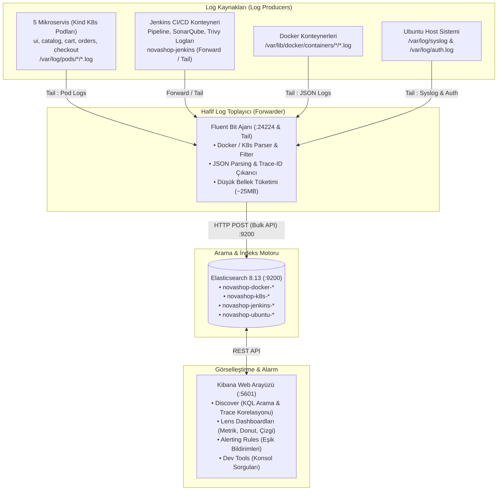
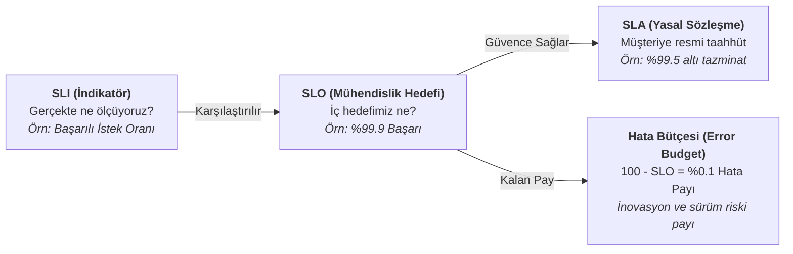

# LAB-11-CENTRALIZED-LOGGING — Kapsamlı Merkezi Loglama (ELK Stack): 5 Mikroservis, Kubernetes, Jenkins CI/CD, Docker ve Ubuntu Günlükleri

---

| Seviye | Profil / Araçlar | Açık Portlar |
| :--- | :--- | :--- |
| **Orta - İleri** | **Elasticsearch 8.13, Kibana 8.13, Fluent Bit, Filebeat, Kind K8s, Jenkins** | `9200` (Elasticsearch), `15601 / 5601` (Kibana), `24224` (Fluent Bit), `18080` (Jenkins) |

---

### Amaç

NovaShop ekosisteminde; **Elasticsearch 8.x** arama ve indeksleme motoru, **Kibana 8.x** analiz ve görselleştirme platformu ile ultra hafif **Fluent Bit** ve **Filebeat** log ileticilerinden oluşan kurumsal seviyede bir **Merkezi Günlükleme (ELK Stack)** altyapısı kurmaktır.

Bu laboratuvarda hem terminal komutlarıyla (CLI / curl / bash) hem de web kullanıcı arayüzünden (Kibana UI) adım adım:
1. Merkezi günlükleme altyapısını Docker Compose ile sıfırdan ayağa kaldırmak,
2. Beş NovaShop mikroservisinin (`ui`, `catalog`, `cart`, `orders`, `checkout`), Kubernetes (Kind) podlarının, Jenkins CI/CD boru hattının ve Ubuntu işletim sisteminin loglarını tek merkezde toplamak,
3. Üç gözlemlenebilirlik sütununu (**Log**, **Metric**, **Trace**) ve olay müdahalesindeki rollerini derinlemesine kavramak,
4. **RED** (Rate, Errors, Duration) ve **USE** (Utilization, Saturation, Errors) metrik modelleri arasındaki farkı anlamak,
5. SRE prensipleri olan **SLI**, **SLA**, **SLO**, **Error Budget** ve **Burn Rate** kavramlarını hem Grafana hem de Kibana Lens üzerinde formüle etmek,
6. Elasticsearch REST API üzerinden indeks oluşturma, doküman ekleme (`_doc`), arama (`_search`) ve `keyword` vs `text` mapping farklarını deneyimlemek,
7. Kibana Data Views (Index Patterns) tanımlamak ve Discover ekranında KQL (Kibana Query Language) ile arama ve `trace_id` korelasyonu yapmak,
8. Jenkins CI/CD derleme, test ve güvenlik taraması loglarını ayrıştırıp incelemek,
9. Kibana Lens ile sıfırdan manuel görsel panolar (Dashboard) tasarlamak ve Saved Objects API ile hazır panoları tek komutla içe aktarmak,
10. Kibana Alerting ile log tabanlı eşik uyarı kuralları (Rules & Alerts) tanımlayıp hata yağmuru simülasyonu ile test etmek hedeflenir.

---

### Ön Koşullar ve Hızlı Hazırlık

> [!NOTE]
> **Bellek ve Kaynak Yönetimi:** ELK yığını (Elasticsearch ve Kibana) yaklaşık 2.5 GB RAM kullanır. Kaynak kısıtı olan sistemlerde bu laboratuvara başlamadan önce önceki ağır profilleri veya arka planda çalışan gereksiz konteynerleri durdurmanız önerilir.

1. **NovaShop Kubernetes Kümesinin Başlatılması (Önerilen):**
   Mikroservis pod loglarının toplanabilmesi için Kind Kubernetes kümesinin ayakta olması önerilir:
   ```bash
   bash scripts/setup-kind-cluster.sh
   ```
   *Doğrulama:* `kubectl get pods -n novashop` komutunda 5 mikroservisin (`ui`, `catalog`, `cart`, `orders`, `checkout`) `Running` olduğu görülür.

2. **Gerekli Sistem Araçları:**
   - Docker v24+ ve Docker Compose v2+
   - `curl`, `jq`, `python3`

---

### Kazanımlar

- **ELK Veri Akış Mimarisi:** Ham log satırının dosyadan çıkıp toplayıcı ajan (Fluent Bit) tarafından ayrıştırılması, Elasticsearch'te indekslenmesi ve Kibana üzerinde görselleştirilmesi zincirini uçtan uca yönetmek.
- **Toplayıcı Karşılaştırması:** Filebeat, Fluent Bit ve Logstash arasındaki bellek tüketimi, hız ve mimari farkları bilerek doğru ajanı seçebilmek.
- **Çok Katmanlı Günlük Toplama:**
  - 5 Adet NovaShop Mikroservisi (`ui`, `catalog`, `cart`, `orders`, `checkout`),
  - Jenkins CI/CD pipeline derleme, test, SonarQube ve Trivy güvenlik günlükleri,
  - Kubernetes (Kind) pod günlükleri (`/var/log/pods/*`),
  - Ubuntu Linux sistem ve kimlik doğrulama günlükleri (`/var/log/syslog`, `/var/log/auth.log`).
- **Elasticsearch Mimarisi & Mapping:** Ters indeks (Inverted Index), doküman şemaları, `keyword` (filtreleme/agregasyon) ve `text` (tam metin araması) ayrımı.
- **Dağıtık İzleme ve Log Korelasyonu:** Jaeger'da tespit edilen hatalı bir isteğin `trace_id` değeri ile Kibana Discover'da mikroservis zincirindeki tüm ilgili logları anında listelemek.
- **SRE & Hata Bütçesi Formülasyonu:** Log ve zaman serisi üzerinden SLI/SLO hesaplamaları ve tükenme hızı (Burn Rate) yönetimi.

---

### Mimari ve Günlük Akış Modeli



---

### Erişim Bilgileri ve Port Tablosu

| Servis | URL / Port | Açıklama | Kimlik Doğrulama |
| :--- | :--- | :--- | :---: |
| **Kibana Web UI** | `http://<SUNUCU_IP>:15601` (veya `5601`) | Günlük analizi, Discover, panolar ve alarmlar | Doğrulama yok (Geliştirme / Test Modu) |
| **Elasticsearch REST API** | `http://<SUNUCU_IP>:9200` | Doğrudan JSON sorguları ve küme sağlığı | `xpack.security=false` |
| **Fluent Bit Forwarder** | `<SUNUCU_IP>:24224` | Docker daemon / uygulamalar için TCP/UDP forward | - |
| **Jenkins Web UI** | `http://<SUNUCU_IP>:18080` | CI/CD boru hattı arayüzü | `admin` / `admin123` |

---

### Üç Gözlemlenebilirlik Sütunu: Log vs. Metric vs. Trace

Modern dağıtık mimarilerde sistem sağlığını anlamak için üç temel gözlemlenebilirlik bileşeni birlikte kullanılır:

| Özellik | Metrik (Metric) | Günlük (Log) | Dağıtık İz (Trace) |
| :--- | :--- | :--- | :--- |
| **Tanım** | Sayısal, toplanabilir (aggregatable) zaman serisi verisi. | Zamana bağlı, bağlam içeren ayrık olay (discrete event) kaydı. | Bir isteğin mikroservisler arasındaki uçtan uca yolculuğu. |
| **Format** | Sayısal sayaç, oran, histogram (`http_requests_total 4200`). | Yapılandırılmış JSON veya düz metin satırı. | Span ağacı (Tree of spans), süreler, `trace_id` ve `span_id`. |
| **Hacim / Boyut** | Çok düşük (birkaç bayt / saniye). Depolaması ucuzdur. | Yüksek (her olay için yüzlerce bayt). Depolaması maliyetlidir. | Orta - Yüksek (örnekleme / sampling ile kontrol edilir). |
| **Cevapladığı Soru** | *"Şu anda sistemde bir sorun var mı? İstek hızı ne? Hata oranı ne?"* | *"Tam olarak ne oldu? Hangi kod satırında exception fırlatıldı?"* | *"İstek nerede takıldı? 5 mikroservisten hangisi darboğaz yarattı?"* |
| **Araç Örneği** | Prometheus, VictoriaMetrics, Datadog | Elasticsearch, Kibana, Grafana Loki, OpenSearch | Jaeger, OpenTelemetry, Zipkin, Tempo |

#### Olay Müdahale Yaşam Döngüsü (Incident Triage Lifecycle)

Bir arıza anında mühendisin izlediği standart adımlar:
1. **Tespit (Metric):** Prometheus ve Grafana panosunda hata oranı metriği eşiği aşar, Alertmanager alarm üretir.
2. **Konumlandırma (Trace):** Jaeger üzerinde yavaş veya 500 dönen istek açılır; çağrı ağacında gecikmenin veya hatanın `novashop-checkout` servisinden kaynaklandığı görülür.
3. **Teşhis (Log):** Jaeger'daki `trace_id` kopyalanır, Kibana Discover arama çubuğuna yapıştırılır. `novashop-checkout` servisinin tam hata mesajı (`"Payment provider timeout after 5000ms"`) ve stack trace'i görülerek kök neden çözülür.

---

### RED vs. USE Metrik Modelleri

| Model | Kapsam | Bileşenler | Kullanım Yeri |
| :--- | :--- | :--- | :--- |
| **RED Modeli** | **İstek ve Servis Odaklı** | **Rate:** Saniyedeki istek sayısı (RPS)<br/>**Errors:** Başarısız istek sayısı (HTTP 5xx)<br/>**Duration:** İsteklerin tamamlanma süresi (Latency) | Mikroservisler, HTTP API'ler, Web arayüzleri |
| **USE Modeli** | **Kaynak ve Donanım Odaklı** | **Utilization:** Kaynağın kullanım yüzdesi (% CPU, % RAM)<br/>**Saturation:** Kuyrukta bekleyen iş miktarı (Load Average)<br/>**Errors:** Donanım / ağ seviyesindeki hata sayısı | Sunucular, Sanal Makineler, Diskler, Ağ kartları |

---

### SRE Disiplini: SLI, SLA, SLO, Error Budget ve Burn Rate



1. **SLI (Service Level Indicator):** Ölçülen gerçek başarı oranıdır:
   $$\text{SLI} = \frac{\text{Başarılı İstek Sayısı}}{\text{Toplam İstek Sayısı}} \times 100$$
2. **SLO (Service Level Objective):** Mühendislik ve operasyon ekibinin iç hedefidir (Örn: Aylık $\%99.9$).
3. **SLA (Service Level Agreement):** Müşteriyle yapılan sözleşmesel taahhüttür (Örn: $\%99.5$). Altına düşüldüğünde finansal cezalar devreye girer.
4. **Hata Bütçesi (Error Budget):** Sistemin izin verilen hata toleransıdır:
   $$\text{Hata Bütçesi} = 100\% - \text{SLO} = 100\% - 99.9\% = 0.1\%$$
5. **Burn Rate (Tükenme Hızı):** Hata bütçesinin harcanma hızıdır. Normal tüketim 1x'tir. 14x hızında tükenen bir bütçe birkaç saat içinde aylık tüm hata payını tüketir. Hata bütçesi bittiğinde yeni özellik dağıtımları durdurulur ve teknik borç temizliğine odaklanılır.

---

### Log Toplayıcı Karşılaştırması: Fluent Bit vs. Filebeat vs. Logstash

| Kriter | Fluent Bit (CNCF) | Filebeat (Elastic) | Logstash (Elastic) |
| :--- | :--- | :--- | :--- |
| **Yazıldığı Dil** | C (Ultra Düşük Kaynak) | Go (Hafif) | Java / JRuby (Ağır) |
| **Bellek Tüketimi** | **~10 - 25 MB** | ~20 - 40 MB | ~500 MB - 1.5 GB |
| **Tasarım Amacı** | Bulut yerlisi (K8s / Docker) yüksek performanslı yönlendirme | Uç birimlerden doğrudan Elasticsearch'e dosya aktarımı | Karmaşık veri dönüşümü, zenginleştirme ve ağır Grok parsing |
| **NovaShop Tercihi** | **Varsayılan Toplayıcı:** Düşük bellek tüketimiyle Kind podlarını ve Docker günlüklerini toplar. | Örnek yapılandırma ile entegre edilmiştir. | Yüksek bellek tüketimi nedeniyle tercih edilmemiştir. |

---

## Adım Adım Uygulama Rehberi (CLI & Web UI)

---

### ADIM 1: Merkezi Loglama Yığınını (ELK) Başlatma

#### 1.1. Terminalden Başlatma (CLI)

Proje dizininde Docker Compose komutunu çalıştırın:

```bash
cd ~/novashop
docker compose -p novashop-logging -f deploy/logging/docker-compose.logging.yml up -d
```

**Konteyner Durumlarını İnceleme:**
```bash
docker compose -p novashop-logging -f deploy/logging/docker-compose.logging.yml ps
```
*Beklenen Durum:* `novashop-elasticsearch`, `novashop-kibana` ve `novashop-fluent-bit` servislerinin `running (Up)` olması.

**Elasticsearch Küme Sağlığını Sorgulama:**
```bash
curl -s http://localhost:9200/_cluster/health | jq .
```
*Beklenen Çıktı:*
```json
{
  "cluster_name": "docker-cluster",
  "status": "green",
  "number_of_nodes": 1,
  "active_primary_shards": 5
}
```

#### 1.2. Web Tarayıcısından Doğrulama (UI)
1. Tarayıcıda `http://<SUNUCU_IP>:9200` adresini açın:
   - Ekranda `"number": "8.13.0"` ve `"tagline": "You Know, for Search"` JSON yanıtı görülmelidir.
2. `http://<SUNUCU_IP>:5601` adresini açın:
   - Kibana karşılama paneli yüklenecektir.

---

### ADIM 2: Çok Kaynaklı Log Toplama Katmanları ve İndeksler

NovaShop Fluent Bit yapılandırması ([deploy/logging/fluent-bit.conf](file:///Users/hakan/devops-workspace/student-novashop/deploy/logging/fluent-bit.conf)) sunucudaki tüm günlükleri dinler:

1. **5 NovaShop Mikroservisi:** `ui`, `catalog`, `cart`, `orders`, `checkout` (JSON formatlı stdout günlükleri).
2. **Kubernetes Podları:** Kind kümesinde `/var/log/pods/*/*/*.log` altındaki pod günlükleri (`novashop-k8s-*`).
3. **Jenkins CI/CD:** Derleme, test, SonarQube ve Trivy güvenlik taraması günlükleri (`novashop-jenkins-*`).
4. **Ubuntu Linux Host:** Sistem ve SSH oturum günlükleri (`/var/log/syslog`, `/var/log/auth.log` -> `novashop-ubuntu-*`).
5. **Docker Konteynerleri:** `/var/lib/docker/containers/*/*-json.log` yolu (`novashop-docker-*`).

**Elasticsearch İndekslerini Listeleme (CLI):**
```bash
curl -s http://localhost:9200/_cat/indices?v
```
*Örnek Çıktı Tablosu:*
```text
health status index                           docs.count store.size
green  open   novashop-docker-2026.09.16             620      280kb
green  open   novashop-k8s-2026.09.16              48210     10.2mb
green  open   novashop-jenkins-2026.09.16             85      120kb
green  open   novashop-ubuntu-2026.09.16           14300      2.7mb
```

---

### ADIM 3: Elasticsearch API Deneyimi: Doküman Ekleme, Arama ve Mapping

Elasticsearch arama motorunun temellerini kavramak için doğrudan API ile etkileşime geçelim.

#### 3.1. Terminalden (curl ile) Doküman Ekleme ve Arama

Örnek bir sipariş hatası kaydı ekleyin:

```bash
curl -s -X POST http://localhost:9200/novashop-demo/_doc \
  -H "Content-Type: application/json" \
  -d '{
    "@timestamp": "2026-09-16T12:00:00Z",
    "service": "novashop-checkout",
    "level": "ERROR",
    "http_status": 504,
    "user_id": "usr-8821",
    "trace_id": "c1d2e3f4a5b67890",
    "message": "Payment gateway timeout after 5000ms"
  }' | jq .
```
*Çıktı:* `"_id": "...", "result": "created"` dönecektir.

**Eklenen Dokümanı Arama:**
```bash
curl -s "http://localhost:9200/novashop-demo/_search?q=level:ERROR" | jq '.hits.hits[0]._source'
```

#### 3.2. Kibana Dev Tools Konsolu ile Çalışma (UI)

1. Kibana sol menüsünde en alta inip **Management ➔ Dev Tools** seçeneğine tıklayın.
2. Konsol editörüne şu komutları yazın ve yeşil çalıştırma butonuna (▶) basın:

```http
POST novashop-demo/_doc
{
  "@timestamp": "2026-09-16T12:05:00Z",
  "service": "novashop-cart",
  "level": "WARN",
  "message": "Stock is low for product ID 502"
}
```

3. İndeksin otomatik oluşan şemasını (Mapping) inceleyin:
```http
GET novashop-demo/_mapping
```

> **Önemli Kavram: `keyword` vs `text`:**
> - **`keyword`:** Tam eşleşme (exact match), filtreleme ve agregasyon (gruplama) için kullanılır. Örneğin `service.keyword: "novashop-checkout"` veya `level.keyword: "ERROR"`.
> - **`text`:** Doğal dil arama motoru (full-text search) ve Inverted Index (ters dizin) için kullanılır. Kelime kelime ayrıştırılır (`message: *timeout*`).

---

### ADIM 4: Hazır E-Ticaret Örnek Veri Seti (Sample Data)

Kibana'nın zengin hazır analiz yeteneklerini görmek için örnek veri setini yükleyin.

#### 4.1. Terminalden Tek Komutla (CLI)
```bash
bash scripts/load-kibana-sample-data.sh
```
*Bu komut; 4.600+ sipariş, kategori kırılımları ve hazır gelir panosunu saniyeler içinde Elasticsearch'e aktarır.*

#### 4.2. Kibana Arayüzünden (UI)
1. Kibana ana sayfasına (`http://<SUNUCU_IP>:5601`) gidin.
2. Sayfa altındaki **"Add sample data"** butonuna tıklayın.
3. **Sample eCommerce orders** kartında **"Add data"** butonuna basın.
4. Yükleme bitince **"View data"** ile hazır `[eCommerce] Revenue Dashboard` panosunu açın.

---

### ADIM 5: Kibana Data Views (Index Patterns) Yapılandırması

Elasticsearch indekslerindeki verileri Kibana Discover ve Dashboard üzerinde sorgulayabilmek için Data View tanımlanmalıdır.

#### 5.1. Terminalden Otomatik Oluşturma (CLI)

Tüm veri görünümlerini tek seferde tanımlayın:

```bash
bash scripts/setup-kibana-dataviews.sh
```

Bu betik şu Data View tanımlarını API üzerinden kaydeder:
- `novashop-*` (Tüm K8s, Docker, Jenkins ve Ubuntu loglarını kapsayan çatı görünüm - ID: `novashop-all`)
- `novashop-docker-*` (Docker konteynerleri ve mikroservisler)
- `novashop-k8s-*` (Kubernetes podları)
- `novashop-jenkins-*` (Jenkins CI/CD boru hattı logları)
- `novashop-ubuntu-*` (Ubuntu sistem logları)

#### 5.2. Kibana Arayüzünden Manuel Oluşturma (UI)

1. Sol menüden **Management ➔ Stack Management** sayfasına gidin.
2. **Kibana ➔ Data Views** seçeneğine tıklayın.
3. Sağ üstteki **Create data view** butonuna basın:
   - **Name:** `NovaShop — Tüm Sistem Logları`
   - **Index pattern:** `novashop-*`
   - **Timestamp field:** `@timestamp`
4. **Save data view to Kibana** butonuna basarak kaydedin.

---

### ADIM 6: Kibana Discover ve KQL ile Arama & Trace-ID Korelasyonu

Kibana sol menüsünden **Analytics ➔ Discover** ekranına gidin. Sol üstteki açılır menüden `novashop-*` görünümünü seçin.

#### 6.1. Pratik KQL (Kibana Query Language) Sözdizimi

| Arama Amacı | KQL Sorgu İfadesi |
| :--- | :--- |
| **Yalnızca Hatalar:** | `level: "ERROR"` |
| **Spesifik Mikroservis Hatası:** | `service: "novashop-checkout" and level: "ERROR"` |
| **HTTP 5xx Hataları:** | `http_status >= 500` |
| **Kubernetes Pod Logları:** | `log_source: "kubernetes_pod"` |
| **Ubuntu Sistem Logları:** | `log_source: "ubuntu_system"` |
| **Jenkins CI/CD Logları:** | `log_source: "jenkins_cicd"` |
| **Jenkins Başarısız Aşama:** | `service: "jenkins" and level: "ERROR"` |
| **Dağıtık Trace-ID Takibi:** | `trace_id: "c1d2e3f4a5b67890"` |

#### 6.2. Jenkins CI/CD Günlüklerini İnceleme

KQL arama çubuğuna şunu yazın:
```kql
log_source: "jenkins_cicd"
```
Listelenen satırlarda Jenkins boru hattı aşamalarını (`Checkout`, `Unit-Tests`, `SonarQube`, `Trivy-Scan`, `Docker-Push`, `GitOps-Deploy`) ve derleme numaralarını (`Build #42`) görebilirsiniz.

SonarQube veya Trivy güvenlik kapısı hatalarını görmek için:
```kql
log_source: "jenkins_cicd" and level: "ERROR"
```

#### 6.3. Dağıtık Trace-ID Korelasyon Deneyi

1. KQL filtre çubuğuna bir `trace_id` yapıştırın:
   ```kql
   trace_id: "a1b2c3d4e5f60718"
   ```
2. Çıkan sonuçlarda `novashop-ui`, `novashop-catalog`, `novashop-cart`, `novashop-orders` ve `novashop-checkout` servislerinin bu istek boyunca ürettiği tüm satırlar kronolojik sırayla dizilir.
3. Böylece kullanıcının tıkladığı andan itibaren isteğin hangi mikroservisten geçtiği ve nerede hata aldığı tek ekranda kanıtlanır.

---

### ADIM 7: Kibana Dashboard Tasarımı (CLI İçe Aktarma & Lens ile Manuel Çizim)

#### 7.1. Terminalden Otomatik İçe Aktarma (CLI)

Hazırladığımız eksiksiz merkezi loglama panosunu tek komutla yükleyin:

```bash
bash scripts/import-kibana-dashboard.sh
```

**Panoları Canlı Loglarla Besleme:**
```bash
bash scripts/simulate-traffic.sh --burst 30
```
*Bu komut; 5 mikroservis, Kubernetes podları ve Jenkins CI/CD boru hattı için gerçekçi loglar üretip Elasticsearch'e yazar.*

**Panoya Doğrudan Erişim:**
Tarayıcınızda açın:
`http://<SUNUCU_IP>:5601/app/dashboards#/view/novashop-central-logging`

#### 7.2. Kibana Lens ile Sıfırdan Manuel Panel Tasarlama (UI)

Kendi panonuzu sıfırdan oluşturmak için:

1. Sol menüden **Analytics ➔ Dashboard** sayfasına gidin.
2. **Create dashboard** butonuna tıklayın.
3. **Create visualization** butonuna basarak **Kibana Lens** editörünü açın.

##### Panel 1: Toplam Log Sayacı (Metric)
- Sol üstteki veri kaynağının `novashop-*` olduğundan emin olun.
- Sağdaki alan listesinden **Records** alanını orta alana sürükleyip bırakın.
- Grafik tipi otomatik olarak büyük bir sayısal sayaç (**Metric**) olacaktır.
- Sağ üstteki **Save and return** butonuna basın.

##### Panel 2: Mikroservis Log Hacmi Dağılımı (Donut Chart)
- Tekrar **Create visualization** butonuna tıklayın.
- Sağdaki alan listesinden `service.keyword` alanını orta alana sürükleyin.
- Grafik tipini üst bardan **Donut** (veya Pie) seçin.
- Beş mikroservisin (`ui`, `catalog`, `cart`, `orders`, `checkout`) ve `jenkins` servisinin pasta dilimleri halinde log oranları görünecektir.
- **Save and return** butonuna basın.

##### Panel 3: Zamana Göre Hata Trendi (Date Histogram)
- **Create visualization** butonuna tıklayın.
- Üst filtre çubuğuna `level: "ERROR"` yazın.
- Yatay eksene `@timestamp`, dikey eksene **Records** ekleyin (Bar veya Line Chart).
- Zamana göre sistemdeki hataların tepe yaptığı anlar görselleşir.
- **Save and return** butonuna basın.

##### Panel 4: Jenkins CI/CD Aşama Dağılımı (Bar Chart)
- **Create visualization** butonuna tıklayın.
- Filtreye `log_source: "jenkins_cicd"` yazın.
- Yatay eksene `stage.keyword`, dikey eksene **Records** ekleyin.
- Jenkins boru hattı aşamalarının log sayıları sütun grafik olarak listelenir.
- **Save and return** butonuna basın.

4. Sağ üstteki **Save** butonuna basarak panonuza `"NovaShop — Canlı Operasyon Panosu"` adını verip kaydedin.

---

### ADIM 8: Kibana Alerting (Alarm ve Eşik Uyarı Kuralları Tanımlama)

Kritik hata eşikleri aşıldığında operasyon ekibini haberdar edecek bir alarm kuralı tanımlayalım.

#### 8.1. Web Arayüzünden Kural Tanımlama (UI)
1. Kibana sol menüsünden **Management ➔ Stack Management** sayfasına gidin.
2. **Alerts and Insights ➔ Rules** sekmesine tıklayın.
3. Sağ üstteki **Create rule** butonuna basın:
   - **Name:** `Kritik Mikroservis Hata Alarmı`
   - **Check every:** `1m` (Her 1 dakikada kontrol et)
   - **Notify:** `On check`
4. **Rule type** olarak **Index threshold** seçin:
   - **Define query:**
     - **Index:** `novashop-*`
     - **WHEN:** `count()`
     - **OVER:** `all documents`
     - **WHERE:** `level: "ERROR"`
     - **IS ABOVE:** `5`
     - **FOR THE LAST:** `5 minutes`
5. **Save** butonuna basarak kuralı etkinleştirin.

#### 8.2. Alarmı Tetikleme Testi (CLI)

Kasıtlı olarak yoğun hata patlaması göndererek kuralı tetikleyin:

```bash
bash scripts/simulate-traffic.sh --error-burst --burst 25
```

Kibana **Rules** sayfasında kuralın durumunun `Active (Firing)` durumuna geçtiğini ve üretilen uyarı geçmişini gözlemleyin.

---

### ADIM 9: SRE SLO & SLI Hesaplama Uygulamaları

#### 9.1. Grafana Üzerinde PromQL ile SLI & SLO Formülleri

Grafana'da bir **Stat** veya **Gauge** paneli ekleyerek şu formüller girilir:

1. **Kullanılabilirlik SLI (Availability %):**
   ```promql
   (sum(rate(http_server_requests_seconds_count{status!~"5.."}[30d])) 
   / 
   sum(rate(http_server_requests_seconds_count[30d]))) * 100
   ```
   *Eşik değerleri: Yeşil 99.9, Sarı 99.5, Kırmızı 99.0.*

2. **Gecikme (Latency) SLI (%95 İstek < 200ms):**
   ```promql
   (sum(rate(http_server_requests_seconds_bucket{le="0.2"}[30d])) 
   / 
   sum(rate(http_server_requests_seconds_count[30d]))) * 100
   ```

3. **Kalan Hata Bütçesi (Remaining Error Budget %):**
   ```promql
   100 - ((100 - (sum(rate(http_server_requests_seconds_count{status!~"5.."}[30d])) / sum(rate(http_server_requests_seconds_count[30d])) * 100)) / 0.1 * 100)
   ```

#### 9.2. Kibana Lens Üzerinde Log Tabanlı SLI Hesaplama

Kibana Lens editöründe **Formula** alanına şu ifade yazılır:

```text
(count() - count(kql='level: "ERROR"')) / count() * 100
```
Bu formül, sisteme gelen toplam log satırı içerisindeki hatasız log oranını yüzdesel olarak hesaplar.

---

### Doğrulama ve Temizlik

#### Otomatik Doğrulama Betiği
```bash
bash scripts/verify/verify-lab-11.sh localhost:9200
```
*Tüm laboratuvar paketini doğrulamak için:*
```bash
bash scripts/verify/verify-all-labs.sh
```

#### Temizlik ve Kaynakları Kapatma
Laboratuvar tamamlandığında merkezi loglama yığınını kapatmak için:
```bash
docker compose -p novashop-logging -f deploy/logging/docker-compose.logging.yml down -v
```
