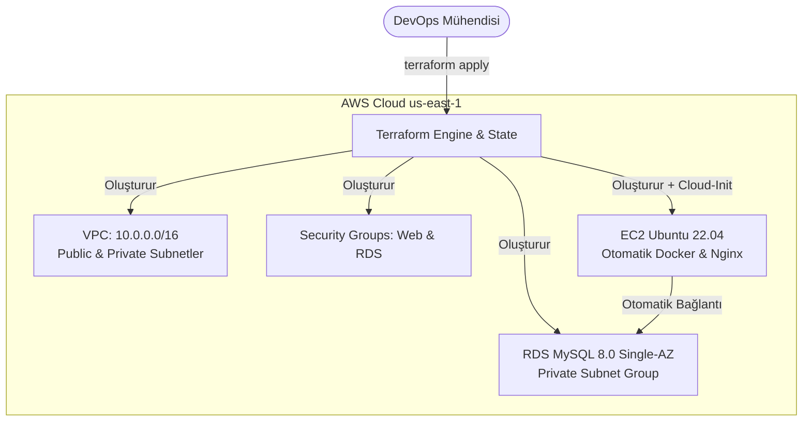

# LAB-12-TERRAFORM-IAC — Altyapı Kod Olarak (IaC): Terraform ile EC2, RDS ve Cloud-Init Otomasyonu

| Seviye | Profil / Araçlar | Açık Portlar |
|---|---|---|
| Orta - İleri | HashiCorp Terraform, AWS EC2, RDS MySQL, Cloud-Init | 22 (SSH), 80 (HTTP), 3306 (MySQL Private) |

---

### Amaç

AWS üzerindeki 3-katmanlı NovaShop altyapısını (VPC, Subnetler, Security Groups, EC2 ve RDS); HashiCorp Terraform ile modüler kod (Infrastructure as Code - IaC) olarak tanımlamak, cloud-init ile otomatik sunucu yapılandırması sağlamak, plan/apply/idempotency (özdeşlik) doğrulaması yapmak ve kontrollü `terraform destroy` ile kaynak temizliğini kanıtlamak.

---

### Kazanımlar

- Altyapıyı Kod Olarak (IaC) yönetmenin prensiplerini ve sürüm kontrolünün avantajlarını kavramak.
- Modüler Terraform dizin yapısı (`vpc`, `security_groups`, `compute`, `database`) tasarlamak.
- `terraform init`, `terraform plan`, `terraform apply` ve `terraform destroy` komut yaşam döngüsünü uygulamak.
- `cloud-init` / `user_data` şablonları ile EC2 başlatılırken Docker ve Nginx kurulumunu tam otomatik gerçekleştirmek.
- Idempotency (özdeşlik) ilkesini test ederek, ikinci bir `terraform apply` koşumunda altyapıda hiçbir gereksiz değişiklik olmadığını (`0 to add, 0 to change, 0 to destroy`) doğrulamak.

---

### Ön koşullar

> [!NOTE]
> Bu laboratuvar AWS Cloud ortamı kullanır. Yerel Kind veya Docker platformlarımız maliyetsiz çalışırken, bu lab için geçerli bir AWS hesabı ve IAM erişim yetkisi gerekmektedir.

- **Önceki Lab:** [LAB-02](../LAB-02/README.md) tamamlanmış olmalıdır.
- **AWS Hesabı:** VPC, EC2 ve RDS oluşturma yetkisine sahip AWS kullanıcısı veya ortam değişkenleri (`AWS_ACCESS_KEY_ID`, `AWS_SECRET_ACCESS_KEY` veya IAM Rolü).
- **Yüklü Araçlar:** Terraform v1.5+ (`terraform -version`), AWS CLI v2, Git.

---

### Mimari



---

### Kullanılan placeholder'lar

| Placeholder | Anlamı | Örnek Biçim |
|---|---|---|
| `<AWS_REGION>` | AWS çalışma bölgesi | `us-east-1` |
| `<PROJECT_NAME>` | Terraform proje ön eki | `novashop-iac` |

---

### Adımlar

#### 1. Terraform Kod Yapısını İnceleme

Terraform kodları modüler ve okunabilir şekilde organize edilmiştir:

```text
terraform/
├── main.tf           # Sağlayıcı (Provider) ve modül çağrıları
├── variables.tf      # Girdi değişkenleri ve açıklamaları
├── outputs.tf        # Çıktı değerleri (EC2 Public IP, RDS Endpoint)
├── terraform.tfvars  # Ortama özel değişken değerleri (Git'e atılmaz)
└── modules/
    ├── vpc/          # Ağ katmanı
    ├── security/     # Güvenlik grupları
    ├── compute/      # EC2 ve user_data (cloud-init)
    └── database/     # RDS MySQL
```

**Örnek Provider ve Modül Tanımı (`main.tf`):**
```hcl
terraform {
  required_version = ">= 1.5.0"
  required_providers {
    aws = {
      source  = "hashicorp/aws"
      version = "~> 5.0"
    }
  }
}

provider "aws" {
  region = var.aws_region

  default_tags {
    tags = {
      Project     = "NovaShop"
      Environment = "Production"
      ManagedBy   = "Terraform"
    }
  }
}
```

---

#### 2. Cloud-Init ile Otomatik EC2 Başlatma Betiği (`user_data.sh`)

Sunucu ayağa kalktığında Docker ve Nginx'i insan müdahalesi olmadan otomatik kuran cloud-init şablonu:

```bash
#!/bin/bash
set -e

apt-get update -y
apt-get install -y docker.io nginx curl

systemctl enable --now docker
systemctl enable --now nginx

# Nginx 200 Sağlık Kontrolü Sayfasını Oluştur
cat << 'EOF' > /etc/nginx/conf.d/healthz.conf
server {
    listen 80 default_server;
    location = /healthz {
        default_type application/json;
        return 200 '{"status":"UP","provisioner":"terraform-cloud-init"}\n';
    }
    location / {
        default_type text/html;
        return 200 '<h1>NovaShop Terraform Altyapisi Aktif</h1>';
    }
}
EOF

rm -f /etc/nginx/sites-enabled/default
nginx -t && systemctl restart nginx
```

---

#### 3. Terraform Projesini Başlatma (Init)

Sağlayıcı (AWS Provider) eklentilerini indirin:

```bash
cd terraform
terraform init
```
*Beklenen çıktı:* `Terraform has been successfully initialized!`

---

#### 4. Değişiklik Planını Çıkarma ve İnceleme (Plan)

Terraform'un hangi kaynakları oluşturacağını planlayın:

```bash
terraform plan -out=tfplan
```
*Beklenen çıktı:* `Plan: 8 to add, 0 to change, 0 to destroy.`

---

#### 5. Altyapıyı Otomatik Oluşturma (Apply)

Planlanan kaynakları AWS üzerinde oluşturun:

```bash
terraform apply tfplan
```
*Açıklama:* VPC, Subnet'ler, Güvenlik Grupları, EC2 ve RDS MySQL yaklaşık 6-8 dakika içinde tam otomatik olarak kurulur.  
*Beklenen çıktı:*
```text
Apply complete! Resources: 8 added, 0 changed, 0 destroyed.

Outputs:
ec2_public_ip = "3.120.xx.xx"
rds_endpoint  = "novashop-catalog-db.cxxxx.us-east-1.rds.amazonaws.com"
```

---

#### 6. Idempotency (Özdeşlik) Doğrulaması

Terraform'un en önemli gücü özdeşliktir. Altyapıda hiçbir değişiklik yapmadan tekrar plan çalıştırıldığında sıfır değişiklik bildirmelidir:

```bash
terraform plan
```
*Beklenen çıktı:*
```text
No changes. Your infrastructure matches the configuration.
```
Bu çıktı, altyapı kodunun ve canlı durumun (State) tam bir uyum içinde olduğunu kanıtlar.

---

#### 7. Canlı Sistemin Otomatik Doğrulanması

Terraform çıktısındaki EC2 Public IP adresini test edin:

```bash
EC2_IP=$(terraform output -raw ec2_public_ip)
curl -s http://${EC2_IP}/healthz
```
*Beklenen çıktı:*
```json
{"status":"UP","provisioner":"terraform-cloud-init"}
```

---

#### 8. Otomatik Laboratuvar Doğrulama Betiğini Çalıştırma

Terraform sözdizimini, biçimlendirmesini ve secret sızıntı denetimini otomatik test betiği ile doğrulayın:

```bash
bash scripts/verify/verify-lab-12.sh terraform/
```
*Beklenen çıktı:*
```text
=== [LAB-12] Terraform IaC Doğrulama Başlatılıyor ===
✅ Terraform dizini bulundu: terraform/
✅ Terraform dosyalarında düz metin parola bulunamadı.
=== [LAB-12] Terraform IaC Doğrulaması Başarılı! ===
```

---

### Troubleshooting

#### Senaryo 1: `Error: Error acquiring the state lock`
- **Belirti:** Terraform komutunun state kilidi nedeniyle çalışmaması.
- **Muhtemel Neden:** Önceki bir komutun yarıda kesilmesi veya başka bir sürecin çalışıyor olması.
- **Güvenli Çözüm:** İşlemin sonlandığından emin olduktan sonra: `terraform force-unlock <LOCK_ID>`.

#### Senaryo 2: `InvalidParameterCombination: DBInstance class not supported`
- **Belirti:** RDS oluşturulurken `db.t3.micro` sınıfının desteklenmediği hatası.
- **Güvenli Çözüm:** `variables.tf` içinde bölgeye uygun instance tipini güncelleyin (`db.t4g.micro` veya `db.t3.small`).

---

### Güvenlik Notu

1. **State Dosyası Güvenliği (`terraform.tfstate`):**
   - State dosyası RDS şifreleri ve altyapı detaylarını içerebilir; **kesinlikle Git'e commit edilemez** (`.gitignore` koruması zorunludur). Üretimde şifreli S3 + DynamoDB state locking kullanılır.
2. **Hassas Değişkenler (Sensitive Variables):**
   - Şifre değişkenleri `sensitive = true` olarak tanımlanır; terminal loglarında maskelenir.

---

### Cleanup / Rollback

Oluşturulan tüm AWS kaynaklarını tek bir komutla ve sıfır kalıntı bırakacak şekilde silin:

```bash
terraform destroy -auto-approve
```
*Beklenen çıktı:* `Destroy complete! Resources: 8 destroyed.`

---

### Pratik Uygulama Görevi

1. `variables.tf` dosyasında yeni bir etiket değişkeni (`Owner = "DevOps-Engineer"`) tanımlayın.
2. `terraform plan` çalıştırarak yalnızca tag güncellemelerinin tespit edildiğini doğrulayın.
