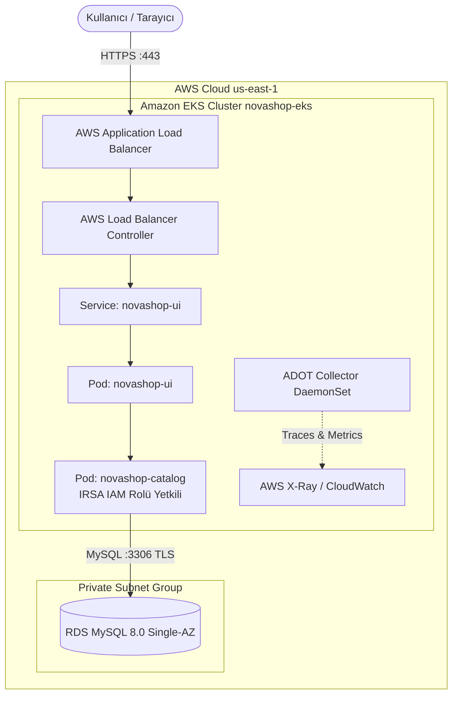

# LAB-13-EKS-ENTERPRISE — Kurumsal Kubernetes: AWS EKS, RDS, Argo CD, ADOT ve Güvenilirlik Yönetimi

| Seviye | Profil / Araçlar | Açık Portlar |
|---|---|---|
| İleri | AWS EKS, IRSA, eksctl, Argo CD, ADOT | 80/443 (ALB), 3306 (RDS Private) |

---

### Amaç

AWS üzerinde yönetilen kurumsal Kubernetes servisi olan Amazon EKS (Elastic Kubernetes Service) kümesi kurmak; IRSA (IAM Roles for Service Accounts) ile pods-level AWS yetkilendirmesi uygulamak, NovaShop mikroservislerini Argo CD GitOps ile dağıtmak, AWS Distro for OpenTelemetry (ADOT) ve CloudWatch/X-Ray ile izlemek ve kontrollü bir kesinti/kurtarma (disaster recovery) senaryosunu doğruladıktan sonra sıfır maliyetle eksiksiz temizlik yapmak.

---

### Kazanımlar

- Yönetilen Kubernetes mimarisini (Amazon EKS Control-Plane ve Managed Node Groups) kavramak.
- Kalıcı AWS anahtarları yerine **IRSA (IAM Roles for Service Accounts)** ile pod bazlı en az ayrıcalıklı IAM yetkilendirmesi kurmak.
- EKS üzerinde çalışan Catalog podunun private subnet'teki RDS MySQL veritabanına güvenli erişimini yapılandırmak.
- Argo CD ile EKS kümesine otomatik GitOps dağıtımı yapmak.
- AWS Distro for OpenTelemetry (ADOT) ile dağıtık izleme ve metrikleri toplamak.
- AWS EKS maliyet tuzaklarından kaçınmak ve lab sonrası tüm kaynakları eksiksiz imha etmek (Cost Discipline).

---

### Ön koşullar

- **Önceki Lablar:** [LAB-06](../LAB-06/README.md), [LAB-09](../LAB-09/README.md) ve [LAB-12](../LAB-12/README.md) tamamlanmış olmalıdır.
- **Yüklü Araçlar:** `aws` CLI v2, `kubectl` v1.28+, `eksctl` v0.160+, `helm` v3.12+.
- **AWS İzinleri:** EKS, CloudFormation, EC2, IAM, VPC oluşturma yetkileri.

> [!CAUTION]
> **KRİTİK MALİYET UYARISI:**  
> Amazon EKS küme yönetim düzlemi (Control-Plane) **saatlik $0.10** ücrete tabidir ve AWS Free Tier kapsamında DEĞİLDİR. Çalışan her worker node (EC2) ve Load Balancer ek ücrete tabidir. Bu lab tamamlandıktan hemen sonra **Cleanup / Rollback** adımları eksiksiz çalıştırılmalıdır!

---

### Mimari



---

### Kullanılan placeholder'lar

| Placeholder | Anlamı | Örnek Biçim |
|---|---|---|
| `<EKS_CLUSTER_NAME>` | EKS küme adı | `novashop-eks` |
| `<AWS_REGION>` | AWS çalışma bölgesi | `us-east-1` |
| `<AWS_ACCOUNT_ID>` | 12 haneli AWS hesap numarası | `123456789012` |

---

### Adımlar

#### 1. `eksctl` ile EKS Kümesini Başlatma

Küme konfigürasyon dosyasını (`eks-cluster.yaml`) oluşturun:

```yaml
apiVersion: eksctl.io/v1alpha5
kind: ClusterConfig

metadata:
  name: novashop-eks
  region: us-east-1
  version: "1.28"

iam:
  withOIDC: true

managedNodeGroups:
  - name: novashop-workers
    instanceType: t3.medium
    desiredCapacity: 2
    minSize: 1
    maxSize: 3
    volumeSize: 20
    privateNetworking: true
```

**Kümeyi Oluşturma:**
```bash
eksctl create cluster -f eks-cluster.yaml
```
*Açıklama:* CloudFormation üzerinden VPC, EKS Control-Plane ve 2 adet worker node başlatır (yaklaşık 12-15 dakika).  
*Beklenen çıktı:* `[✓]  EKS cluster "novashop-eks" in "us-east-1" region is ready`.

---

#### 2. IRSA (IAM Roles for Service Accounts) Kurulumu

Pod'ların AWS kaynaklarına (RDS, S3, Secrets Manager) erişebilmesi için pod seviyesinde IAM yetkilendirmesi tanımlayın:

```bash
# EKS kümesi için OIDC sağlayıcısını etkinleştir
eksctl utils associate-iam-oidc-provider --cluster novashop-eks --approve

# Catalog servisi için IAM rolü ve ServiceAccount oluştur
eksctl create iamserviceaccount \
  --name novashop-catalog-sa \
  --namespace novashop \
  --cluster novashop-eks \
  --attach-policy-arn arn:aws:iam::aws:policy/AmazonRDSReadOnlyAccess \
  --approve
```
*Açıklama:* Bu sayede pod içine kalıcı AWS Access Key koyma ihtiyacı tamamen ortadan kalkar; pod geçici AWS STS token'ı ile çalışır.

---

#### 3. Argo CD ile EKS Kümesine Dağıtım

EKS kümesi üzerine Argo CD operatörünü kurun ve GitOps boru hattını bağlayın:

```bash
kubectl create namespace argocd
kubectl apply -n argocd -f https://raw.githubusercontent.com/argoproj/argo-cd/stable/manifests/install.yaml

kubectl wait --for=condition=available --timeout=300s deployment/argocd-server -n argocd
```

**NovaShop EKS Application Tanımı:**
```bash
kubectl apply -f - << 'EOF'
apiVersion: argoproj.io/v1alpha1
kind: Application
metadata:
  name: novashop-eks-app
  namespace: argocd
spec:
  project: default
  source:
    repoURL: https://github.com/devopsatolyesi-labs/novashop.git
    targetRevision: HEAD
    path: charts/novashop
  destination:
    server: https://kubernetes.default.svc
    namespace: novashop
  syncPolicy:
    automated:
      prune: true
      selfHeal: true
    syncOptions:
      - CreateNamespace=true
EOF
```

---

#### 4. AWS Distro for OpenTelemetry (ADOT) ile İzleme

EKS üzerinde ADOT EKS Eklentisini (Add-on) kurun:

```bash
aws eks create-addon \
  --cluster-name novashop-eks \
  --addon-name adot \
  --region <AWS_REGION>
```
*Açıklama:* Pod'ların telemetri verilerini (istek sayıları, gecikmeler, hatalar) doğrudan AWS X-Ray ve CloudWatch Container Insights panellerine aktarır.

---

#### 5. Güvenilirlik ve Kurtarma Testi (Pod Eviction & Drain)

Bir worker node arızalandığında Kubernetes'in iş yükünü diğer düğüme kesintisiz aktardığını test edin:

```bash
# 1. Düğümleri listele
NODE_NAME=$(kubectl get nodes -l eks.amazonaws.com/nodegroup=novashop-workers -o jsonpath="{.items[0].metadata.name}")

# 2. Düğümü bakıma al ve podları tahliye et (Drain)
kubectl drain $NODE_NAME --ignore-daemonsets --delete-emptydir-data

# 3. Podların diğer düğümde yeniden başladığını izle
kubectl get pods -n novashop -o wide
```
*Beklenen çıktı:* Pod'lar ikinci düğümde `Running` durumuna geçer; kullanıcı trafiğinde kesinti yaşanmaz.

---

#### 6. Otomatik Laboratuvar Doğrulama Betiğini Çalıştırma

EKS küme durumunu, IRSA ServiceAccount tanımlarını ve temizlik gereksinimlerini otomatik test betiği ile doğrulayın:

```bash
bash scripts/verify/verify-lab-13.sh novashop-eks <AWS_REGION>
```
*Beklenen çıktı:*
```text
=== [LAB-13] Amazon EKS Doğrulama Başlatılıyor (novashop-eks / <AWS_REGION>) ===
✅ EKS kümesi aktif durumda: novashop-eks
✅ IRSA IAM Rol anotasyonu bulundu: arn:aws:iam:...
=== [LAB-13] Amazon EKS Doğrulama Tamamlandı ===
```

---

### Troubleshooting

#### Senaryo 1: `eksctl create cluster` CloudFormation Rollback Hatası
- **Belirti:** Küme kurulurken `ResourceCreationCancelled` veya `CREATE_FAILED` hatası.
- **Muhtemel Neden:** AWS hesabında VPC veya Elastic IP (EIP) limitinin dolmuş olması.
- **Güvenli Çözüm:** Kullanılmayan eski VPC ve EIP kaynaklarını temizleyin: `aws ec2 describe-vpcs`.

#### Senaryo 2: IRSA Pod İçinde AWS Kimliğini Doğrulayamıyor
- **Belirti:** Pod loglarında `AccessDenied: User is not authorized to perform sts:AssumeRoleWithWebIdentity`.
- **Teşhis:** `kubectl get sa novashop-catalog-sa -n novashop -o yaml | grep "eks.amazonaws.com/role-arn"`.
- **Güvenli Çözüm:** ServiceAccount açıklamasındaki (annotation) IAM rol ARN değerinin doğruluğunu kontrol edin.

---

### Güvenlik Notu

1. **Private API Endpoint:**
   - EKS API Server erişimi dış internete tamamen açık tutulmamalı; yalnızca şirket içi VPN veya yetkili istemci IP'si ile sınırlandırılmalıdır (`publicAccessCIDRs`).
2. **Konteyner İzolasyonu:**
   - Pod'lar AWS metadata servisine (`http://169.254.169.254`) doğrudan erişemez; yetkiler yalnızca IRSA üzerinden sağlanır.

---

### Cleanup / Rollback (Zorunlu ve Acil)

> [!CAUTION]
> Faturanıza gereksiz maliyet yansımaması için lab bitiminde aşağıdaki komutları derhal çalıştırın:

```bash
# 1. Argo CD uygulamasını ve isim alanlarını sil
kubectl delete application novashop-eks-app -n argocd 2>/dev/null || true
kubectl delete namespace novashop argocd 2>/dev/null || true

# 2. EKS Kümesini ve tüm bağımlı kaynakları tamamen yok et
eksctl delete cluster -f eks-cluster.yaml --wait

# 3. Kalan CloudFormation stack'i olup olmadığını teyit et
aws cloudformation list-stacks --stack-status-filter CREATE_COMPLETE UPDATE_COMPLETE \
  --query 'StackSummaries[?contains(StackName, `novashop-eks`)].StackName' --output text
```
*Beklenen çıktı:* Sıfır aktif kaynak kalmalıdır.

---

### Pratik Uygulama Görevi

1. EKS kümesinde Horizontal Pod Autoscaler (HPA) tanımlayın:
   ```bash
   kubectl autoscale deployment novashop-ui -n novashop --cpu-percent=50 --min=2 --max=6
   ```
2. HPA durumunu `kubectl get hpa -n novashop` ile görüntüleyin.
