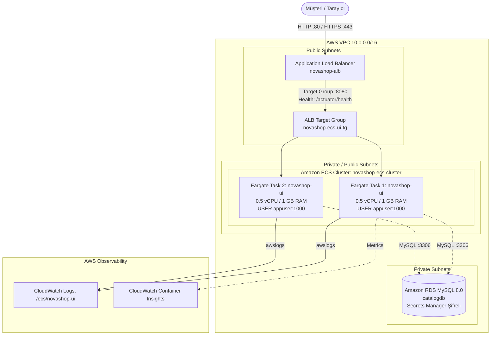

# LAB-14-ECS-FARGATE — Amazon ECS Fargate: Serverless Konteyner, ALB, Terraform IaC, GitHub Actions ve CloudWatch Monitoring

| Seviye | Profil / Araçlar | Açık Portlar |
|---|---|---|
| İleri | AWS ECS Fargate, ALB, Terraform, GitHub Actions, CloudWatch | 80/443 (ALB) |

---

### Amaç

NovaShop mikroservislerini sunucusuz (Serverless) konteyner altyapısı olan **Amazon ECS Fargate** üzerinde çalıştırmak; altyapıyı **Terraform IaC** ile modüler olarak kurmak, ön yüze **Application Load Balancer (ALB)** ile yüksek erişilebilirlik sağlamak, **GitHub Actions** ile sürekli dağıtım (CD) uygulamak ve **CloudWatch Container Insights** ile sistem metriklerini izleyip doğrulamak.

---

### Kazanımlar

- Sunucu veya sanal makine (EC2) yönetimi gerektirmeyen **Serverless Container (AWS Fargate)** çalışma mantığını kavramak.
- ECS bileşenlerini (**Cluster, Task Definition, Service, Task**) uçtan uca yapılandırmak.
- **Application Load Balancer (ALB)** ve **Target Group** ile HTTP/HTTPS trafiğini Fargate görevlerine yük dengelemek.
- Spring Boot Actuator `/actuator/health` endpoint'ini ALB sağlık kontrolü ile entegre etmek.
- **Terraform IaC** modülleri ile ECS Fargate, ALB ve CloudWatch bileşenlerini kodla yönetmek.
- **CloudWatch Container Insights** ve `awslogs` sürücüsü ile CPU/Bellek metriklerini ve dağıtık logları izlemek.
- **GitHub Actions** boru hattı üzerinden Amazon ECS servisine kesintisiz Rolling Update dağıtımı yapmak.

---

### Ön koşullar

> [!NOTE]
> Bu laboratuvar AWS Cloud ortamı kullanır. Yerel Kind veya Docker platformlarımız maliyetsiz çalışırken, bu lab için geçerli bir AWS hesabı ve IAM erişim yetkisi gerekmektedir.

- **Önceki Lablar:** [LAB-01](../LAB-01/README.md), [LAB-03](../LAB-03/README.md) ve [LAB-12](../LAB-12/README.md) tamamlanmış olmalıdır.
- **AWS Hesabı:** ECS, ALB, CloudWatch ve ECR izinlerine sahip AWS IAM kimliği.
- **Yüklü Araçlar:** AWS CLI v2, Terraform v1.5+, `curl`, Git.

---

### Mimari



---

### Kullanılan placeholder'lar

| Placeholder | Anlamı | Örnek Biçim |
|---|---|---|
| `<AWS_REGION>` | Dağıtımın yapılacağı AWS bölgesi | `us-east-1` |
| `<ALB_DNS_NAME>` | ALB'nin genel etki alanı adı | `novashop-alb-123456.us-east-1.elb.amazonaws.com` |
| `<AWS_ACCOUNT_ID>` | 12 haneli AWS hesap numarası | `123456789012` |

---

### Adımlar

#### 1. Terraform ile ECS Fargate ve ALB Altyapısını Başlatma

NovaShop projesinin `terraform/` dizinine geçin ve ECS Fargate modülünü devreye alın:

```bash
cd novashop/terraform
terraform init
terraform plan -target=aws_ecs_service.ui -out=ecsplan
terraform apply ecsplan
```
*Açıklama:* VPC, ALB, Güvenlik Grupları, CloudWatch Log Grubu, ECS Task Definition ve 2 adet replikaya sahip Fargate servisini otomatik olarak ayağa kaldırır.  
*Beklenen çıktı:*
```text
Apply complete! Resources: 9 added, 0 changed, 0 destroyed.

Outputs:
alb_dns_name = "novashop-alb-xxxxxx.us-east-1.elb.amazonaws.com"
ecs_cluster_name = "novashop-ecs-cluster"
ecs_service_name = "novashop-ui-service"
```

---

#### 2. ECS Task Definition ve Non-Root Güvenlik Standartlarını İnceleme

Fargate üzerinde çalışan görev tanımını (`deploy/ecs/task-definition-ui.json`) inceleyin:

```bash
cat deploy/ecs/task-definition-ui.json | jq '.containerDefinitions[0] | {name, image, user, portMappings}'
```
*Beklenen çıktı:*
```json
{
  "name": "ui",
  "image": "public.ecr.aws/aws-containers/retail-store-sample-ui:v1.6.2",
  "user": "appuser",
  "portMappings": [
    {
      "containerPort": 8080,
      "hostPort": 8080,
      "protocol": "tcp"
    }
  ]
}
```
*Açıklama:* Konteynerin `user: "appuser"` (UID 1000) ile non-root çalıştığı ve salt AWS VPC ağ modunda izole edildiği doğrulanır.

---

#### 3. ALB ve Target Group Sağlık Durumunu Doğrulama

Fargate görevlerinin ALB arkasında sağlıklı (`healthy`) duruma geçtiğini teyit edin:

```bash
ALB_DNS=$(terraform output -raw alb_dns_name)

# 1. Spring Boot Actuator Sağlık Kontrolü
curl -s "http://${ALB_DNS}/actuator/health"
```
*Beklenen çıktı:*
```json
{"status":"UP"}
```

```bash
# 2. NovaShop Marka Başlığı Kontrolü
curl -s "http://${ALB_DNS}/" | grep -o "NovaShop DevOps Store"
```
*Beklenen çıktı:*
```text
NovaShop DevOps Store
```

---

#### 4. CloudWatch Logs ve Container Insights İzleme

Konteynerlerin çıktısını ve metriklerini AWS CLI ile sorgulayın:

```bash
# 1. CloudWatch günlük akışlarını listele
aws logs describe-log-streams \
  --log-group-name "/ecs/novashop-ui" \
  --region <AWS_REGION> \
  --query "logStreams[0].logStreamName" --output text

# 2. Son günlükleri görüntüle
STREAM_NAME=$(aws logs describe-log-streams --log-group-name "/ecs/novashop-ui" --region <AWS_REGION> --query "logStreams[0].logStreamName" --output text)
aws logs get-log-events --log-group-name "/ecs/novashop-ui" --log-stream-name "$STREAM_NAME" --region <AWS_REGION> --limit 5
```

---

#### 5. GitHub Actions ile Otomatik ECS Dağıtımı

Deponun `.github/workflows/novashop-ecs-ci.yml` iş akışı, koda yeni bir değişiklik geldiğinde ECS servisini otomatik günceller:

1. Değişikliği `main` branch'ine commit edip push edin.
2. GitHub Actions panelinde **NovaShop Amazon ECS Fargate CI/CD** akışının tetiklendiğini izleyin.
3. ECS'in sıfır kesintiyle yeni görevleri ayağa kaldırıp eskileri tahliye ettiğini (Rolling Update) gözlemleyin.

---

#### 6. Otomatik Laboratuvar Doğrulama Betiğini Çalıştırma

Tüm ECS altyapınızı, Task Definition sözdizimini ve ALB erişilebilirliğini otomatik test betiği ile denetleyin:

```bash
bash scripts/verify/verify-lab-14.sh "$ALB_DNS"
```
*Beklenen çıktı:*
```text
=== [LAB-14] Amazon ECS Fargate ve ALB Doğrulama Başlatılıyor ===
1. Terraform ECS Fargate modül yapısı denetleniyor...
✅ Terraform ECS Fargate, ALB ve Container Insights tanımları doğrulandı.
2. ECS Task Definition JSON dosyaları kontrol ediliyor...
✅ Task Definition JSON geçerli: task-definition-catalog.json
✅ Task Definition JSON geçerli: task-definition-ui.json
✅ GitHub Actions ECS CI/CD iş akışı mevcut (.github/workflows/novashop-ecs-ci.yml).
4. Canlı ALB sağlık kontrolü test ediliyor...
✅ ALB üzerinden Actuator sağlık kontrolü başarılı (HTTP 200 OK).
=== [LAB-14] Amazon ECS Fargate Doğrulaması Başarılı (PASS) ===
```

---

### Troubleshooting

#### Senaryo 1: ECS Task Sürekli `STOPPED` Durumuna Geçiyor (`TaskFailedToStart`)
- **Belirti:** Görev başlatılıyor ancak birkaç saniye içinde duruyor; hata mesajı `CannotPullContainerError` veya `ResourceInitializationError`.
- **Muhtemel Neden:** Fargate görevinin internete çıkıp imajı çekememesi (Subnet'te Route to IGW veya NAT eksikliği) veya `executionRoleArn` yetersizliği.
- **Güvenli Çözüm:** `assign_public_ip = true` ayarının public subnet üzerinde yapıldığından ve `AmazonECSTaskExecutionRolePolicy` rolünün ekli olduğundan emin olun.

#### Senaryo 2: ALB Target Group Durumu `unhealthy` (HTTP 502 / 504)
- **Belirti:** ALB DNS adresine istek atıldığında `502 Bad Gateway` dönüyor ve target group'ta hedefler `unhealthy` görünüyor.
- **Teşhis:** `aws elbv2 describe-target-health --target-group-arn <TG_ARN>`.
- **Güvenli Çözüm:** ECS servis güvenlik grubunun (`novashop-ecs-service-sg`), ALB güvenlik grubundan (`novashop-alb-sg`) gelen 8080 portuna izin verdiğini doğrulayın.

---

### Güvenlik Notu

1. **En Az Ayrıcalık (Least Privilege):**
   - ECS Task Execution Rolü yalnızca imaj çekme (`ecr:GetDownloadUrlForLayer`) ve log yazma (`logs:PutLogEvents`) yetkilerine sahip olmalıdır.
2. **Konteyner İçi İzolasyon:**
   - Görevler `root` yerine `appuser` (UID 1000) ile çalıştırılır; ana makineye root erişimi mümkün değildir.

---

### Cleanup / Rollback

Lab bittiğinde AWS faturasını durdurmak için oluşturulan kaynakları silin:

```bash
cd novashop/terraform
terraform destroy -target=aws_ecs_service.ui -auto-approve
```

---

### Pratik Uygulama Görevi

1. `terraform/ecs.tf` içinde `desired_count = 2` değerini `3` yaparak görevi güncelleyin ve `terraform apply` ile ölçekleyin.
2. AWS konsolunda veya `aws ecs list-tasks` çıktısında 3 görevin de `RUNNING` durumunda olduğunu teyit edin.
